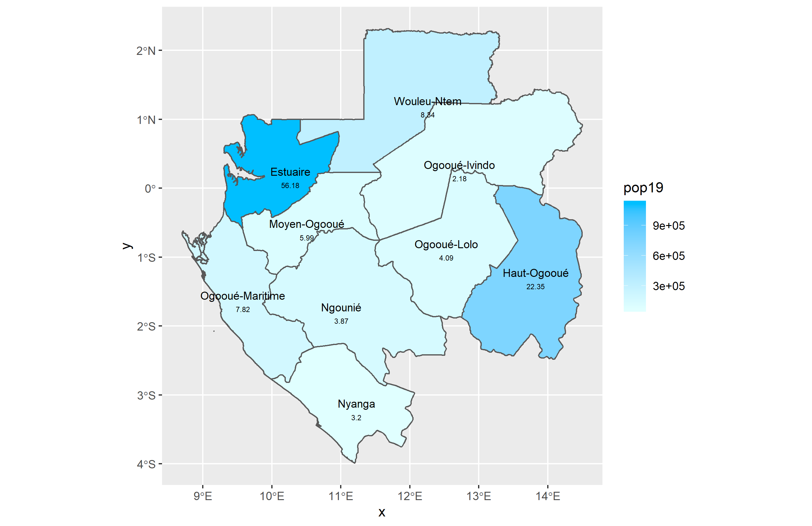

# Project 1: Gabon
Sayyed Hadi Razmjo

### Administration subdivisions of Gabon
Gabon, officially the Gabonese Republic, is a country on the west coast of Central Africa with an area of nearly 100,000 sq mi and 
population of 2.1 million people. Gabon is divided into 9 provinces: 
1. Estuaire (Libreville)
2. Haut-Ogooué (Franceville)
3. Moyen-Ogooué (Lambaréné)
4. Ngounié (Mouila)
5. Nyanga (Tchibanga)
6. Ogooué-Ivindo (Makokou)
7. Ogooué-Lolo (Koulamoutou)
8. Ogooué-Maritime (Port-Gentil)
9. Woleu-Ntem (Oyem)
Gabon is then divided into another 50 departments, with the president appointing one main governor for each province and 50 other 
representatives for subdepartments. 

### Healthsites Accros Gabon
Most of Gabon's health facilities are public, but there are some private institutions as well. Gabon's medical infrastructure is considered one of the best in West Africa. As of 2004, there are 29 physicians per 100,000 people, with nearly 90% of people having access to health care services. Since the western provinces of Gabon is heavily populated due to proximity of water, major public health facilities are also located in there. The red dots on the map shown show the main health facilities through Gabon. The eastern part of Gabon, heavily populated by the lower and middle income families has limited access to an ideal health care services. 

### Southern Gabon Coast (Nyanga County)
Nyanga is the southernmost of Gabon's nine provinces. The provincial capital is Tchibanga, which had a total of 31294 inhabitants in 2013 (more than the half of the province population). Nyanga is the least populated province of the nine and one of the least developed despite being the southern coast of Gabon with sea ports and trade routes.

### Eastern Gabon States
The Ogooué-Lolo Province is one of the nine provinces of Gabon, slightly southeast of central Gabon. The regional capital is Koulamoutou, a city of approximately 16,000 people. It is the ninth largest city in Gabon and the home of slightly more than one-third of the provincial population.
The Ogooué-Ivindo province is the northeastern-most of Gabon's nine provinces, though its Lopé Department is in the very center of the country. The regional capital is Makokou, which is home to one-third of the provincial population. It gets its name from two rivers, the Ogooué and the Ivindo. This province is the largest, least populated, and least developed of the nine.

### Population distribution map over Gabon's 9 provinces
Gabon has a total of 2.1 million population with Libreville, Estuaire being the most populated city with 703,940 people living in it. That is the reason the heat map is red on Estuaire province. Ngounié is the least populated province accross all 9 provinces. 

### Population distribution map over Gabon's districts
As previously mentioned, the western coast of Gabon is heavily populated due to its proximity to big waters. The Estuaire province, the capital of Gabon, is home to more than 700,000 people. The eastern coast of Gabon is less populated compared to the western coast. This map shows the population distribution over Gabon's districts

### population distribution map (districts and provinces both shown)

### 3-D Visual description of Population distribution in Gabon

### Population Distribution in Gabon on a geometric bar

### Population Density on Gabon's each province

### Population Density and Geometric bar visual representation side by side

### Geometric bar describing Gabon's population density based on its sub districts. 
 
