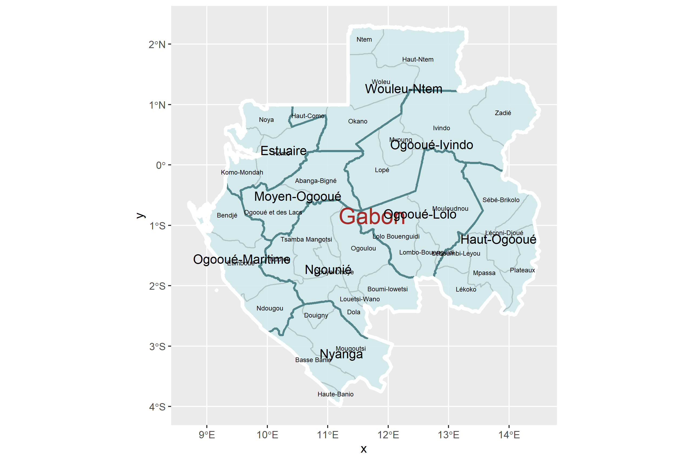
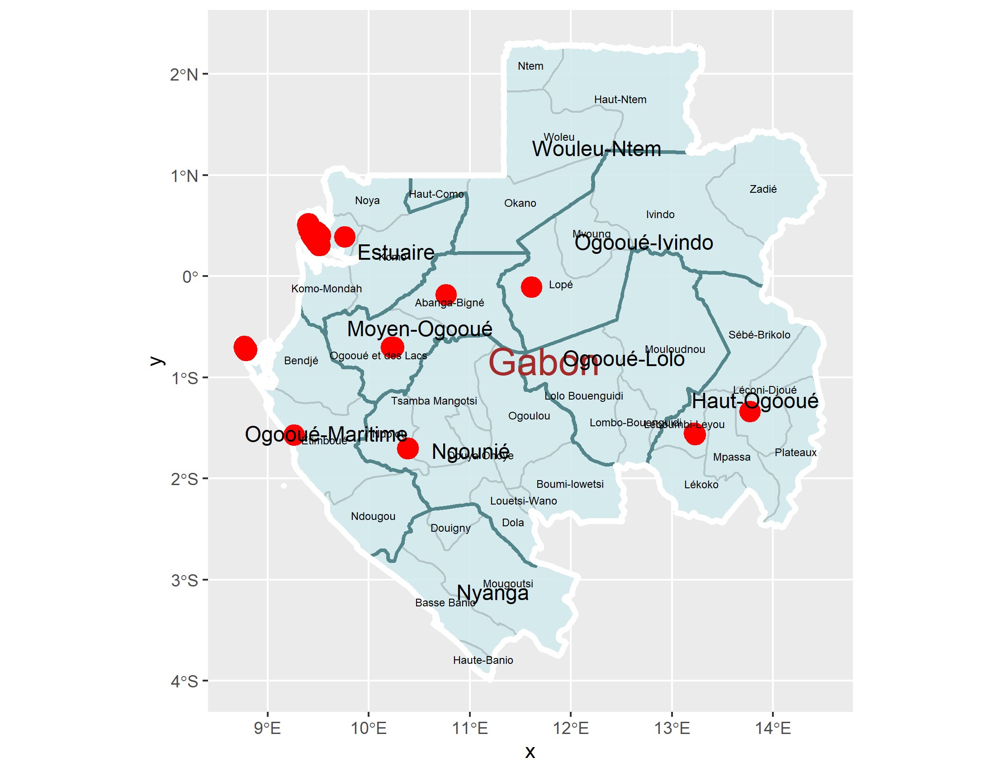
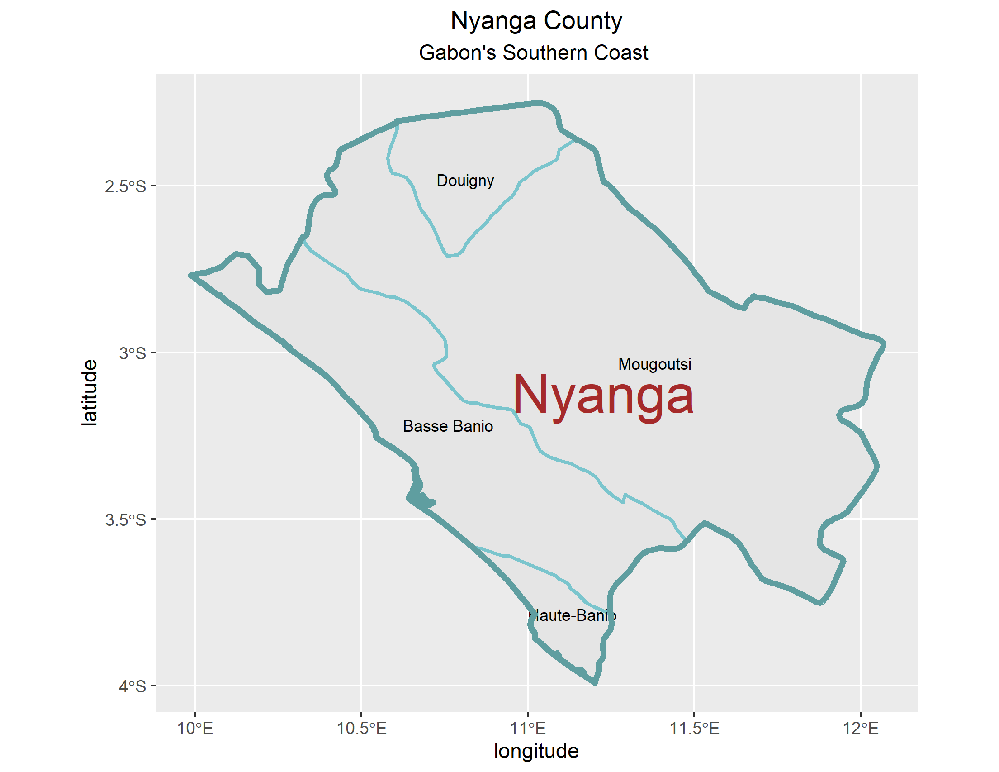
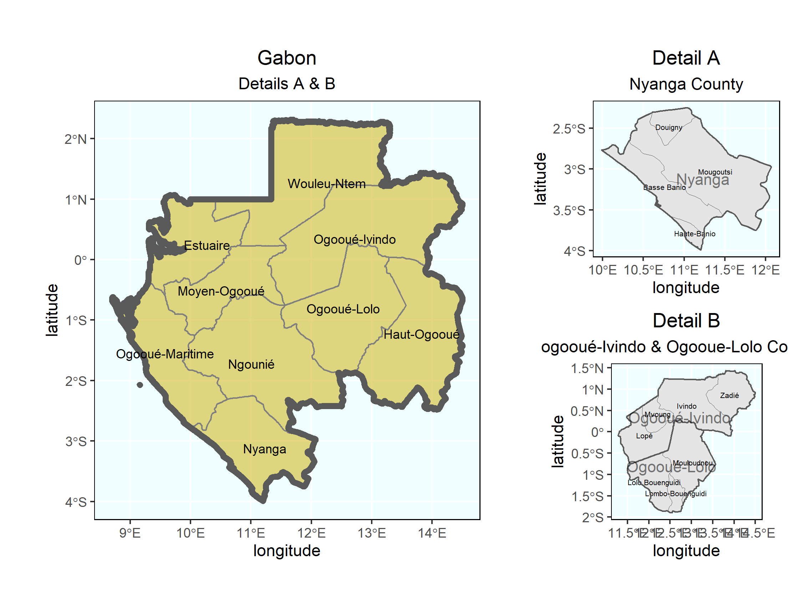

# Project 1: Gabon
By Sayyed Hadi Razmjo

### Administration subdivisions of Gabon
Gabon is a country on the west coast of Central Africa with an area of nearly 100,000 sq mi and 
population of 2.1 million people. Gabon is divided into 9 provinces: 
1. Estuaire (Libreville) - Captial province
2. Haut-Ogooué (Franceville)
3. Moyen-Ogooué (Lambaréné)
4. Ngounié (Mouila)
5. Nyanga (Tchibanga)
6. Ogooué-Ivindo (Makokou)
7. Ogooué-Lolo (Koulamoutou)
8. Ogooué-Maritime (Port-Gentil)
9. Woleu-Ntem (Oyem)
Gabon is then divided into another 50 departments. Located on the equator, Gabon is bordered by Equatorial Guinea to the northwest, Cameroon to the north, the Republic of the Congo on the east and south, and the Gulf of Guinea to the west. Abundant petroleum and foreign private investment have helped make Gabon one of the most prosperous countries in Sub-Saharan Africa, with the fourth highest GDP per capita in the region. GDP grew by more than 6% per year from 2010 to 2012. However, because of inequality in income distribution, a significant proportion of the population remains poor.

### Healthsites Accros Gabon
Most of Gabon's health facilities are public, but there are some private institutions as well. Gabon's medical infrastructure is considered one of the best in West Africa. As of 2004, there are 29 physicians per 100,000 people, with nearly 90% of people having access to health care services. Since the western provinces of Gabon is heavily populated due to proximity of water, major public health facilities are also located in there. The red dots on the map shown show the main health facilities through Gabon. The eastern part of Gabon, heavily populated by the lower and middle income families has limited access to an ideal health care services. 

### Southern Gabon Coast (Nyanga County)
Nyanga is the southernmost of Gabon's nine provinces. The provincial capital is Tchibanga, which had a total of 31294 inhabitants in 2013 (more than the half of the province population). Nyanga is the least populated province of the nine and one of the least developed despite being the southern coast of Gabon with sea ports and trade routes. The Atlantic Ocean—the lowest point in both Gabon and Nyanga Province—borders it in the west. Nyanga is divided into 3 districts: Douigny, Basse Banio, and Nauti Banio which is then divided into 6 other sub-departments. 

### Nyanga County with two other Eastern Gabon States
The Ogooué-Lolo Province is one of the nine provinces of Gabon, slightly southeast of central Gabon. It has a total area of 9,800 sq mi. The regional capital is Koulamoutou, a city of approximately 16,000 people. It is the ninth largest city in Gabon and the home of slightly more than one-third of the provincial population.
The Ogooué-Ivindo province is the northeastern-most of Gabon's nine provinces, though its Lopé Department is in the very center of the country. The regional capital is Makokou, which is home to one-third of the provincial population. It gets its name from two rivers, the Ogooué and the Ivindo. This province is the largest, least populated, and least developed of the nine.

### Population distribution map over Gabon's 9 provinces
Gabon has a total of 2.1 million population with Libreville, Estuaire being the most populated city with 703,940 people living in it. That is the reason the heat map is red on Estuaire province. Ngounié is the least populated province accross all 9 provinces. As obvious on the map, the western coast of Gabon is a major trade center and that is the reason western coast cities and provinces have relatively more population than central and eastern provinces of Gabon. Gabon's economy is mostly dependent on oil reserves which is concentrated in western cities. Haut-Ogoouie, eastern border of Gabon, having the famous Mpassa river crossing it, is a trade route to Republic of Congo, a major customer for Gabon's oil reserves. This clearly proves the fact that people have populated the major cities and have left the central part of Gabon relatively vacant. In fact, Central Gabon has one of the least population density across the region. This also shows the spread of poverty in Gabon. The richest 20% of the population earn over 90% of the income while about a third of the Gabonese population lives in absolute poverty.

### Population distribution map over Gabon's districts
As previously mentioned, the western coast of Gabon is heavily populated due to its proximity to big waters. The Estuaire province, the capital of Gabon, is home to more than 700,000 people. The eastern coast of Gabon is less populated compared to the western coast. This map shows the population distribution over Gabon's districts with light red showing the districts with the least population and dark red representing the districts with the highest populations. Per population map, Komo-Mondah is the most populated district which is located in the Estuaire province, the capital of Gabon. Mpassa district, Franceville, located on the eastern part of Gabon, is also highly populated. Franceville is one of the four largest cities in Gabon, with a population of around 110,568 people. It lies on the River Mpassa and at the end of the Trans-Gabon Railway and the N3 road, which is the reason that Mpassa district is a trade center in Gabon. Central districts are almost evenly populated which clearly shows a pattern of even resource distribution in central Gabon. 

### population distribution map (districts and provinces both shown)
This map shows log of population distribution across provinces and districts with three colors distinguishing cities with least, average, and highest number of population. 

### 3-D Visual description of Population distribution in Gabon
Using Rayshader library, this 3-D visual description of population distribution enables the reader to easily analyse the data gathered by the scientists. The provinces with higher population are shown higher in height and provinces with lower population are shown with shorter heights. This visual is also filled with three colors to ease distinguishing densely populated cities from less populated cities. 

### Population Distribution in Gabon on a geometric bar
Based on the data gathered from GADM and HDX, as anticipated previously, Estuaire is home to 38.51% of Gabon's citizens. Nyanga is ranked the last with 2.40% of Gabon's population living in it. Except Estuaire and Haut-Ogoouie (Gabon's major business centers), that have more than 15% of Gabon's population, other provinces all have 10% or lesser percent of population, which once again shows the uneven settlement across Gabon. 

### Population Density on Gabon's each province
As stated previously, Gabon has one of the least population density statistics across the region. Nyanga has a surprising 3.2 people living on 1 km^2. On the other hand, Estuaire has a density of 56.18 despite being about the same area size as Nyanga. People tend to leave the suburbs to move to the main cities in order to get better jobs and earn more money to survive. Again except Estuaire and Haut-Ogoouie, that have double digits density, all other provinces have less 9 people living on a square kilometer. 

### Population Density and Geometric bar visual representation side by side
This is just a compare and contrast between two maps and showing them side by side to better translate the data. 

### Geometric bar describing Gabon's population density based on its sub districts. 
This geometric bar shows the population distribution over Gabon's districts. The density of Komo-Mondah district, located in capital Liberville, Estuaire, simply outweighs almost 7 other provinces based on its density. This single district is denser than all other 7 provinces. It is almost twice as denser as Haut-Ogoouie province, one of the most important provinces in Gabon. 
 

Citations:

