# Final Project: Gabon
##### My final project on Gabon
##### By Sayyed Hadi Razmjo
##### W&M 2023

## Administrative subdivisions of Gabon
Gabon is a country on the west coast of Central Africa with an area of nearly 100,000 sq mi and 
population of 2.1 million people. Gabon has 9 provinces which are then divided into another 37 departments:
1. Estuaire (Libreville) - Captial province
2. Haut-Ogooué (Franceville)
3. Moyen-Ogooué (Lambaréné)
4. Ngounié (Mouila)
5. Nyanga (Tchibanga)
6. Ogooué-Ivindo (Makokou)
7. Ogooué-Lolo (Koulamoutou)
8. Ogooué-Maritime (Port-Gentil)
9. Woleu-Ntem (Oyem)

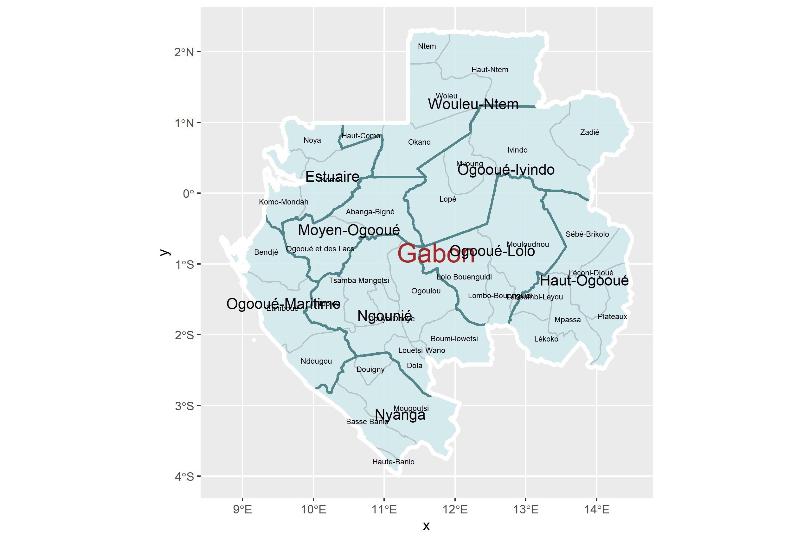

Let's explore Gabon's least developed and least populated province: Nyanga

#### Southern Gabon Coast (Nyanga County)
Nyanga is the southernmost of Gabon's nine provinces. The provincial capital is Tchibanga, which had a total of 31294 inhabitants in 2013. Nyanga is the least populated province of the nine and one of the least developed despite being the southern coast of Gabon with sea ports and trade routes. The Atlantic ocean is located on the western side of Nyanga, making it an strategically important province. Nyanga is divided into 3 districts: Douigny, Basse Banio, and Nauti Banio which is then divided into 6 other sub-departments. 

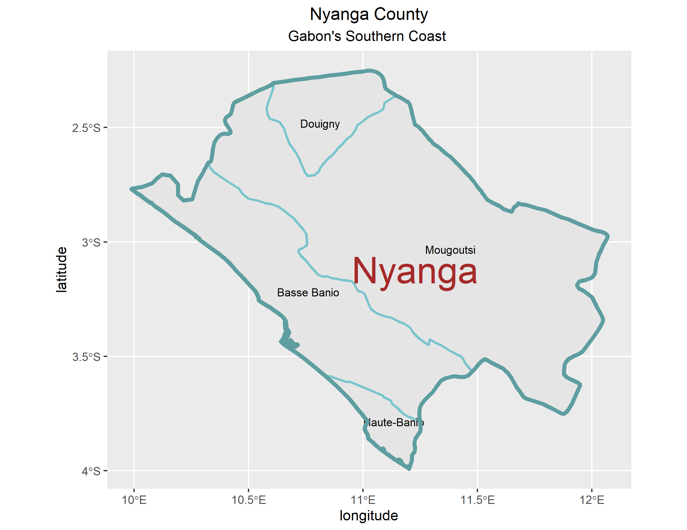

#### Nyanga County with two other Eastern Gabon States
The Ogooué-Lolo Province is one of the nine provinces of Gabon, slightly southeast of central Gabon. It has a total area of 9,800 sq mi. The regional capital is Koulamoutou, a city of approximately 16,000 people. It is the ninth largest city in Gabon and the home of slightly more than one-third of the provincial population.
The Ogooué-Ivindo province is the northeastern-most of Gabon's nine provinces, though its Lopé Department is in the very center of the country. The regional capital is Makokou, which is home to one-third of the provincial population. It gets its name from two rivers, the Ogooué and the Ivindo. This province is the largest, least populated, and least developed of the nine.

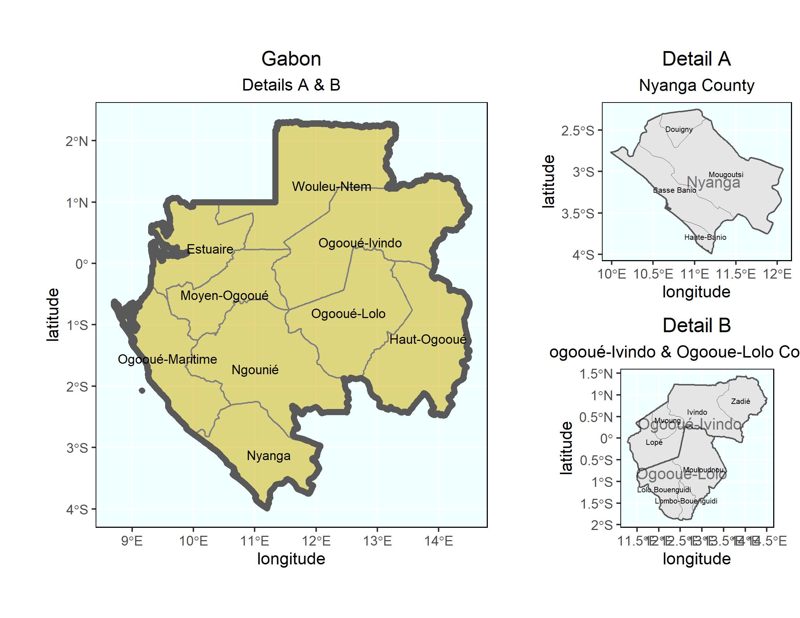

## Population distribution across Gabon's subdivisions
We will analyze population distribution in Gabon for two different levels:

#### Population distribution across Gabon's first administrative levels (provinces):
Gabon has a total of 2.1 million population with Libreville in Estuaire being the most populated city with 703,940 people living in it. As obvious on the map, the western coast of Gabon is a major trade center and that is the reason western coast cities and provinces have relatively more population than central and eastern provinces of Gabon. Gabon's economy is mostly dependent on oil reserves which is concentrated in western cities. Haut-Ogoouie, eastern border of Gabon, having the famous Mpassa river crossing it, is a trade route to Republic of Congo, a major customer for Gabon's oil reserves. This clearly proves the fact that people have populated the major cities and have left the central part of Gabon relatively vacant. In fact, Central Gabon has one of the least population density across the region. This also shows the spread of poverty in Gabon. The richest 20% of the population earn over 90% of the income while about a third of the Gabonese population lives in absolute poverty.

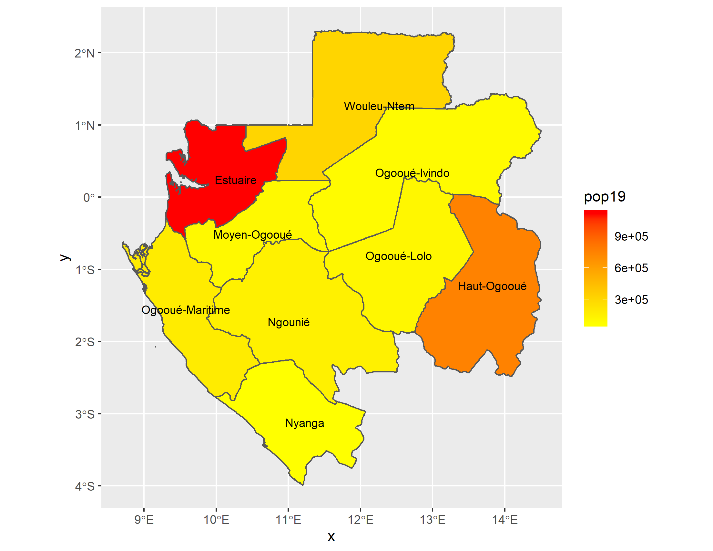

#### Population distribution across Gabon's second administrative levels (districts):
As previously mentioned, the western coast of Gabon is heavily populated due to its proximity to big waters. The Estuaire province, the capital of Gabon, is home to more than 700,000 people. The eastern coast of Gabon is less populated compared to the western coast. This map shows the population distribution over Gabon's districts with light red showing the districts with the least population and dark red representing the districts with the highest populations. Per population map, Komo-Mondah is the most populated district which is located in the Estuaire province, the capital of Gabon. Mpassa district, Franceville, located on the eastern part of Gabon, is also highly populated. Franceville is one of the four largest cities in Gabon, with a population of around 110,568 people. It lies on the River Mpassa and at the end of the Trans-Gabon Railway and the N3 road, which is the reason that Mpassa district is a trade center in Gabon. Central districts are almost evenly populated which clearly shows a pattern of even resource distribution in central Gabon. 

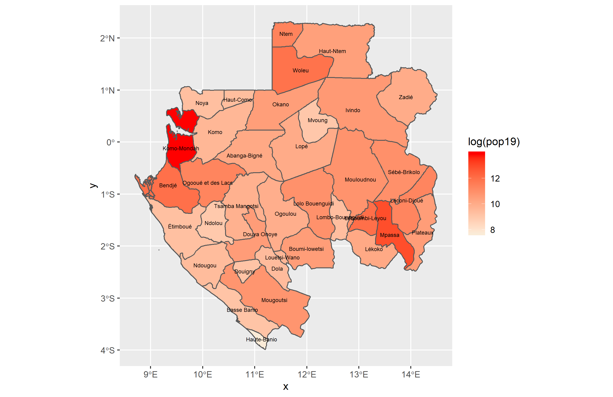

#### A 3-D visualization of population distribution in Gabon:

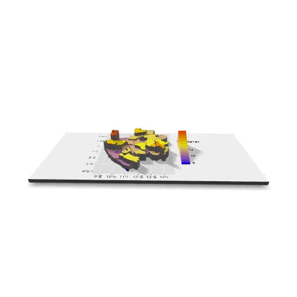

#### Population distribution calculated as a percentage for each subdivision:
In the following geometric bar, you can find out how each subdivision accounts for the total population of Gabon:

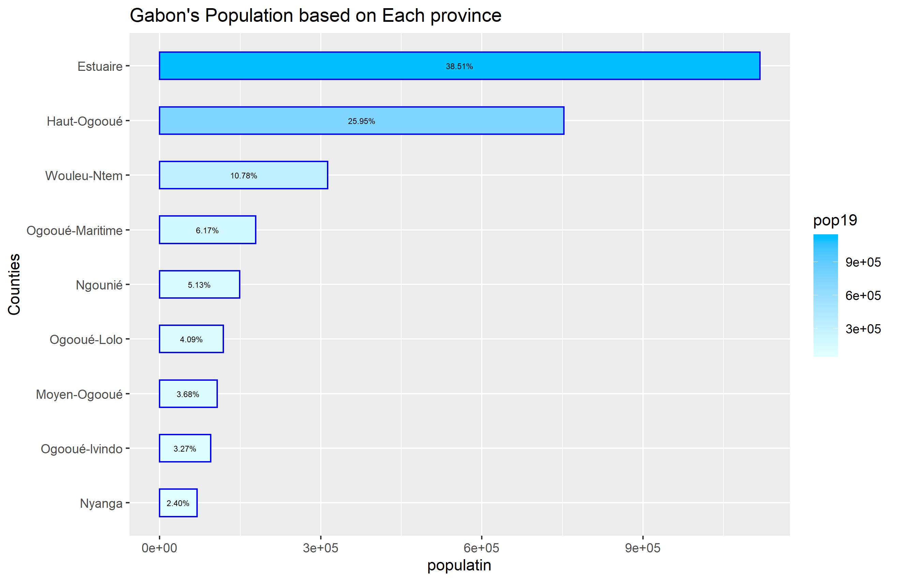

#### Population Density in Gabon's each first subdivision (province):

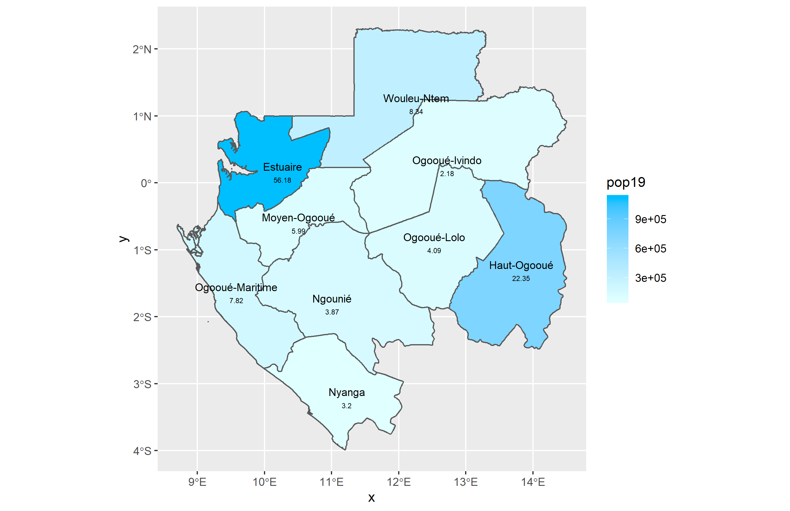

#### Population Density in Gabon's each second subdivision (districts): 
This geometric bar shows the population distribution over Gabon's districts. The density of Komo-Mondah district, located in capital Liberville, Estuaire, simply outweighs almost 7 other provinces based on its density. This single district is denser than all other 7 provinces. It is almost twice as denser as Haut-Ogoouie province, one of the most important provinces in Gabon.

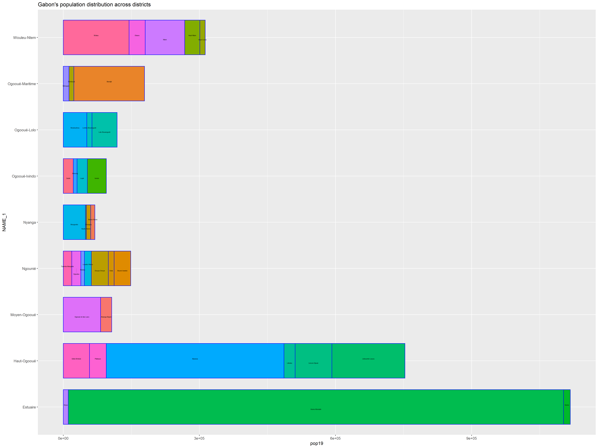 

#### Using Linear Modeling To Analyze Population Distribution

The histogram below is desired to show population distribution accross different adm2s. In my adm2 sf object I now have 28 variables including the topo, ntl, and slope covariates. To start my description and analysis of the land use and land cover data, I first consider the pop19 variable created in the last project.

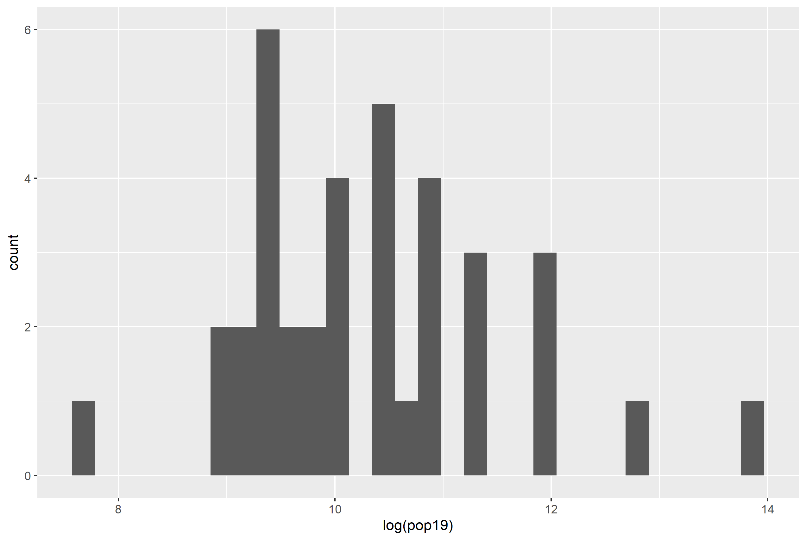

This plot shows density based on log of the population accross adm2. 

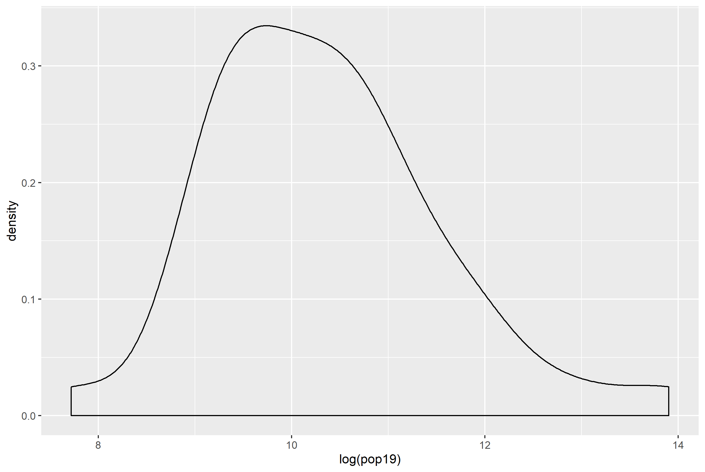

Now that we have plotted different covariates with wrapping pop19 around it, we will regress the data from multiple variables against each other and examine the correlationship that is being described by the variables. For example, in the following plot, I have estimated a regression model where the population of Gabon in 2019 is the dependent variable, while night time lights (ntl), urban cover (dst190), and bare cover (dst200), topo, slope, dst(010), dst(011), dst(130), dst(140), and other covariates are the independent variables (predictors). This plot highlights all the outliers including Komo-Mondah that is a striking outlier, separated from the rest of the regression model and data. We will also calculate F-statistics and R-adjusted Squared for the linear model. The plot below does a linear model estimation of population distribution based on night time lights data gathered from online resources. 

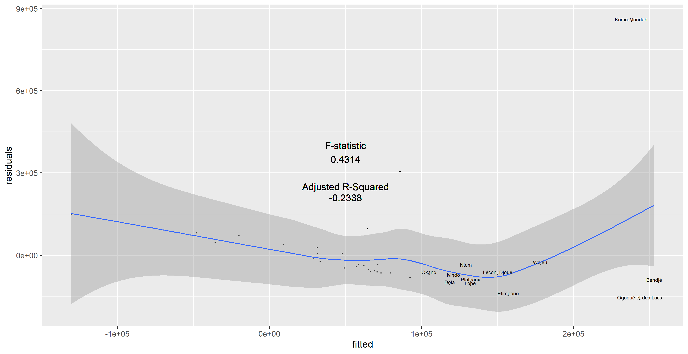

#### Let's subset Mpassa and explore differences between our linear model estimation and the actual Data from the WorldPop website.
This original raster object downloaded from the WorldPop website shows the original population distribution:
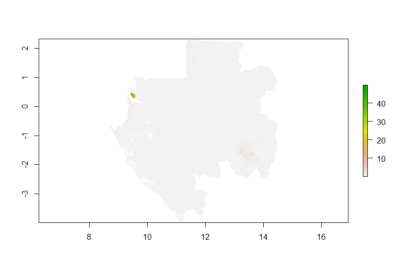

However, after subsetting Mpassa and investigating its population distribution, I found out that my linear model actually overpredicts Mpassa's population distribution in some areas. The following 3-D plot shows the striking overprediction in the central areas of Mpassa, Francesville: 

To get a better visualization, consider the following mapview of Mpassa. The purple areas show the major overpredictions by my linear model estimation:

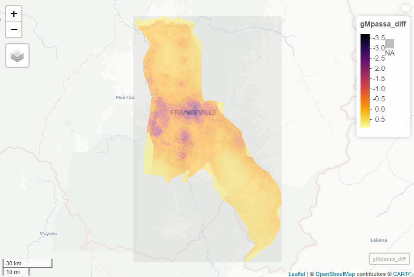

## De facto description of human settlements and urban areas:
To further analyze population distribution, population density, human settlements, urban areas, transportation routes, and healthcare facilities, we will pick two different adm2s and combine them to help us do a better analysis using a compare and contrast approach. 

For this purpose, I chose Ntem and Woleu, Gabon's two northern most first level subdivisions. After unioning both simple feature collections (Ntem and Woleu), we will be able to crop it based on our WorldPop population data to find population distribution across both subdivisions. After cropping, the population of combined subdivison is found to be 232085 persons. We will follow the same steps as we did previously in part one to produce a point per person plot for our combined adm2s. Both the population distribution and point per person plots are shown below:

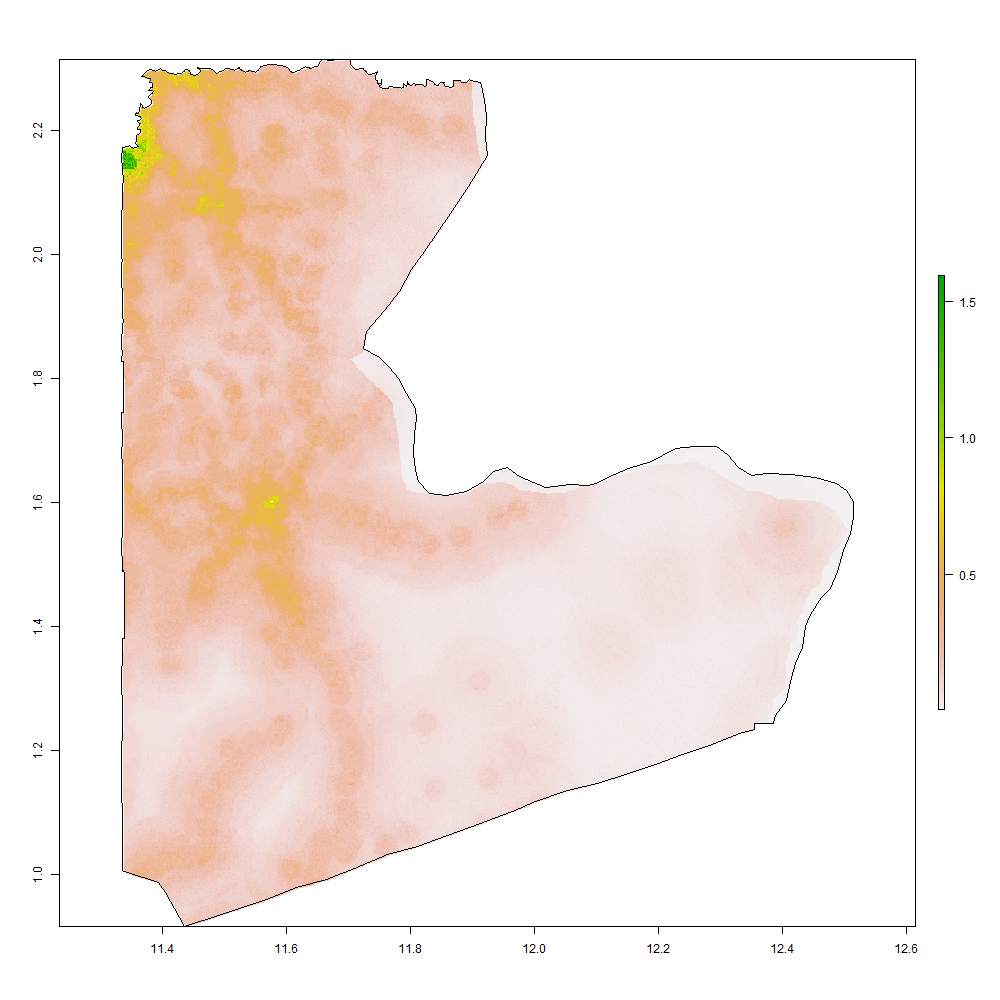

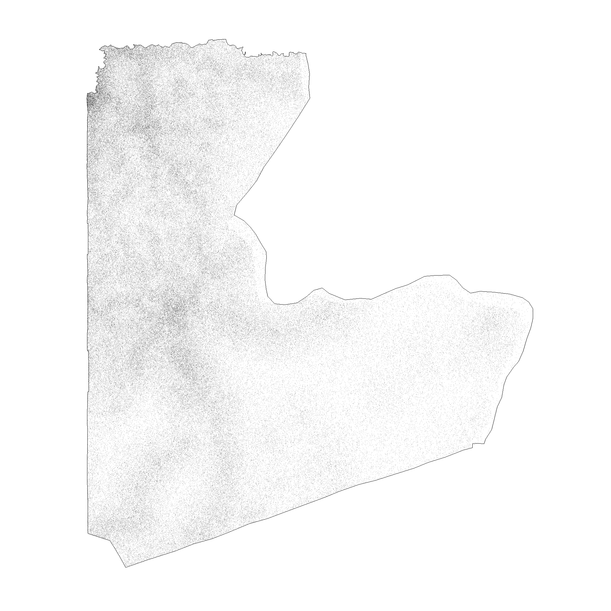

To produce a density plot, first I calculated the bandwidth for the combined adm2s. The BW function for this specific combined adm2s took 4.5 hours to load making the BW step computationally intense. After running the BW, we will be able to produce the density plot. In order to produce a density plot, we will use the same object that we created for plotting the point per person plot. However, we will use the result of the BW as our sigma. Below you can find the density plot for Ntem and Woleu. 

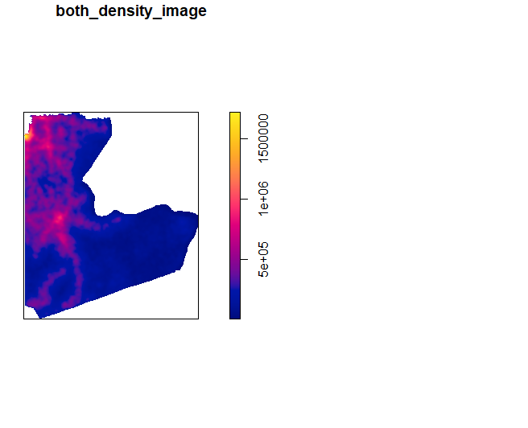

Using our density plot containing the contour lines, we will create some polygons that represent the urbanized areas across our combined adm2s. The produced polygons will have the most density based on our selected number of levels across both Ntem and Woleu. Below the urbanized areas are shown in lightblue and non-urbanized areas are shown in lightgold/gray. Since Ntem is a coastal city, it appears that people of Ntem has populated the western coast while leaving the eastern part uninhibited. We will also add some points (representing the density) to our urbanized areas to show their actual density.

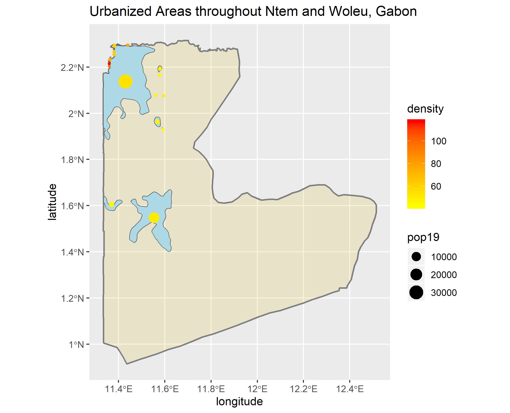

Matching our results with our initial population distribution map confirms that the identified urban areas have the highest population and density:

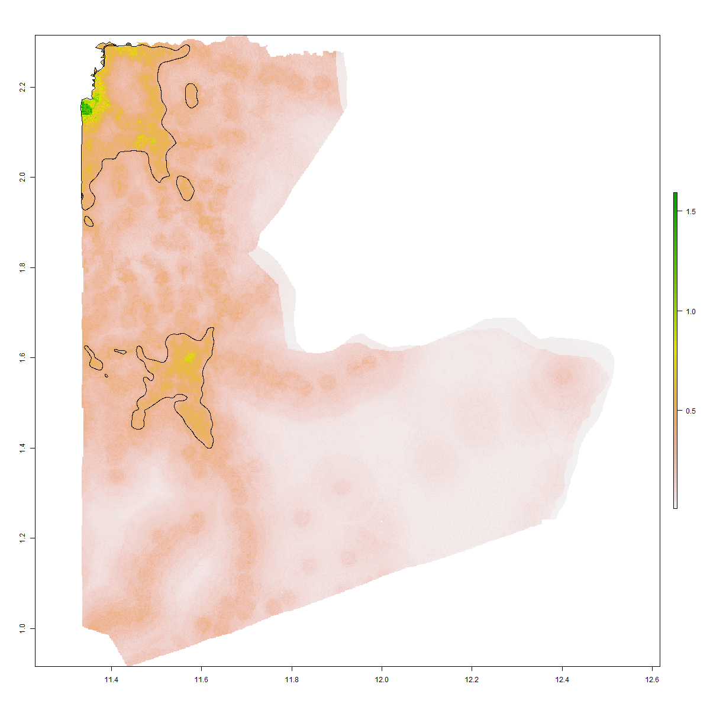

#### We can also add road networks and healthcare facilities to analyze the relationship between the location of the identified urban areas and transportation routes and healthcare facilities. 

|Clinics  | Hospitals   |Pharmacies     | Dentists |
|---------|-------------|---------------|----------|
|1        |1            |               |          |

In the following plot, the orange lines are showing the primary road routes and the blue lines are showing the secondary road networks. Two conclusions can be made: first, the primary road routes are crossing the identified urbanized areas. Second, the roadways are specifically running through our identified density points, showing that roadways are primarily built close to where the density is the most. Given the fact that both Ntem and Woleu are both coastal cities with a lot tourists, there seems to be enough number of transportation routes across both adm2s. The transportation routes joins major urbanized areas with relatively less populated areas and other parts of the subdivision. From the other hand, all healthsites are located at the heart of each subdivison, ensuring the centrality of the healthsite. Though only two healthcare sites can be seen in the whole region, both healthcare sites are located in the heart of our identified urban areas to ensure that major human settlements have adequate access to healthcare. The two green dots in the following map represent the two healthcare facilities across Ntem and Woleu. 

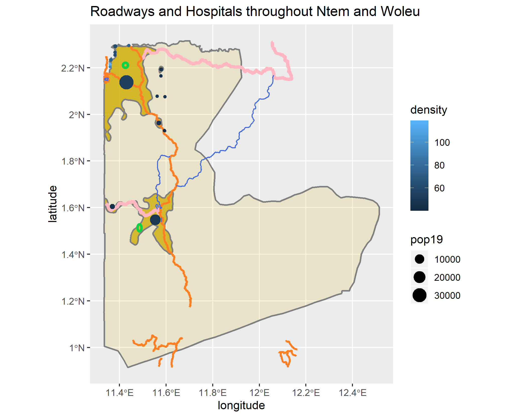

## Analyzing The Topography Of The Area:
In this part, we will produce some 3-D plots for our combined adm2s. Using our knowledge of where Urban Areas are located, we will also add our urban areas, road networks, and healthsites to our 3-D plots to ensure that our previous findings and assumptions are consistent with our results.
We will use the topographic raster used in project 2. Since we are only analyzing two adm2s (Ntem and Woleu), we should crop the topo raster based on our combined adm2s. After cropping the topographic raster based on our combined adm2s borders, we will get the following topographic plot.

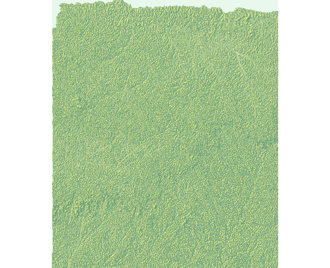

We will also need a political boundary plot so we can add it to the 3-D plot. Below you can find the political boundaries of my combined adm2s:

First, we should convert the cropped raster into a matrix and apply the ambient_shade() command to the topography matrix to produce a three-dimension plot of our combined adm2s. Using our combined matrix and the political boundary plot, we will produce a 3-D plot showing the topographic details of the combined adm2s.

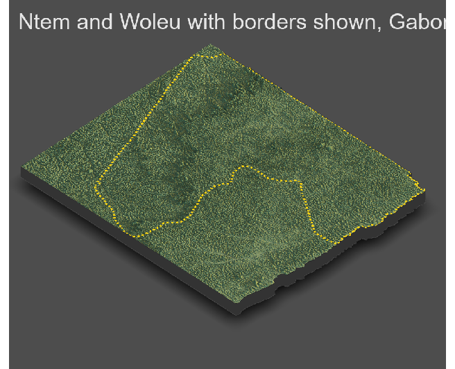

Next up, we import the urban areas polygons from project 3 to add it to our 3-D plot which is shown below. The topography of the area does not appear to have significant impact on the development of urban areas; however, both urban areas are located near waters. Ntem and Woleu are both coastal cities; thus, creating excellent opportunities for Ntem and Woleu's economies. The waters on the western side of Woleu and northern coast of Ntem, have greatly impacted the population concentration in these cities.

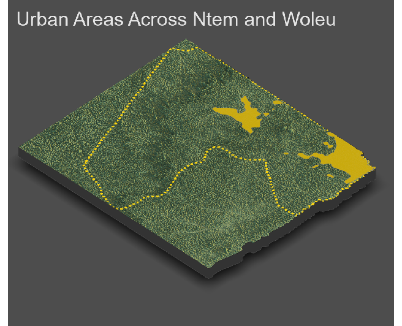

Using the HDX's Gabon Road database, the shp data files are downloaded. The effect of topography is more obvious on the development of transportation facilities, which also helps us interpret the effect of topography on the development of urban area as well. In the previous plot, we don't have adequate information to assert that the topography has an impact on development of urban areas. In the following plot, the primary roads and secondary roads are shown using orange and blue lines. The primary roads are going through the heart of our identified urban areas, confirming that development of urban area are directly related to the development of transportation facilities. The terrain characteristics of settlements can help to understand the effects of the environment on human activities. No major mountains can be observed in the 3-D plot of Ntem and Woleu; rather, almost the whole area is covered with forests and trees, having a lot of precipitation; therefore, creating an ideal opportunity for the population for agricultural businesses- it is not surprising that Gabon's economy is heavily relied on its agricultural products. The vast number of transportation lines show how these subdivisions are highly interconnected with each other to ease the flow of goods and services between the adm2s. The topography of the area seems to support this assumption. From the other hand, there are only two healthcare facilities across our combined adm2s. One is located in the Ntem subdivison and one is located in the heart of Woleu. Both are coastal subdivisons and highly populated especially in the western part. Although not enough to provide healthcare for all the people living in those adm2s, both healthsites are carefully built and located. Both healthsites are located at the heart of each subdivison, ensuring the centrality of the healthsite. However, even if completely mobolized those two healthsites, they cannot provide excellent healthcare for the 232000 population of those combined subdivisions. Once again, the topography of the area doesn't seem to directly impact the location of health care facilities. The topography of the region seems to support the existence of any kind of healthcare facility throughout the whole region. In this case, rather, the location of the urban areas seem to affect the location of the healthcare facilities. As previously mentioned, both healthcare facilities are located in one of our two identified urban areas, implying that the concentration of population in those two urban areas is a crucial factor in where those healthcare facilities are located. 

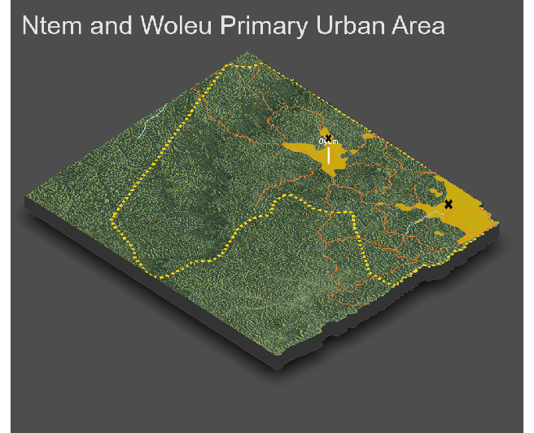
