# Project 2: Using Linear Modeling To Analyze Population Distribution
### Sayyed Hadi Razmjo

This Projects Has 3 Parts:

## Part 1
Extracting Land Use and Land Cover Data for Description

This histogram is desired to show population distribution accross different adm2s. Since the numbers are very big, the log function is used to scale them according to the x-axis. 

This plot shows density based on log of the population accross adm2. 

Notice that the density plot has a similar profile as the histogram.  We can compare the two by overlapping the histogram with the density plot or probability density function. 
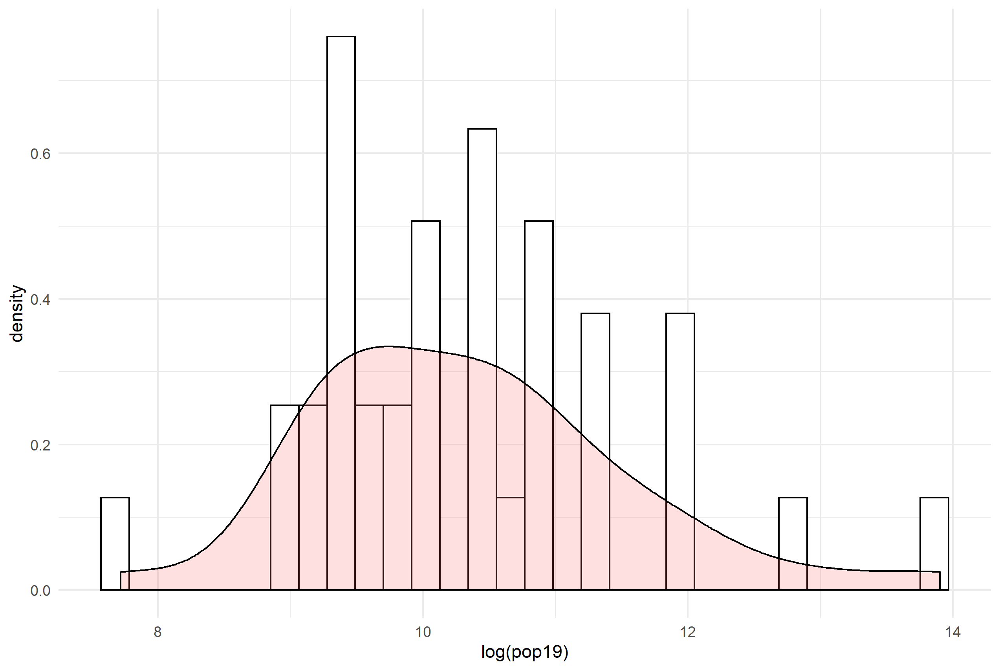

This plot does a linear model estimation of night time lights based on where the population is distributed. 
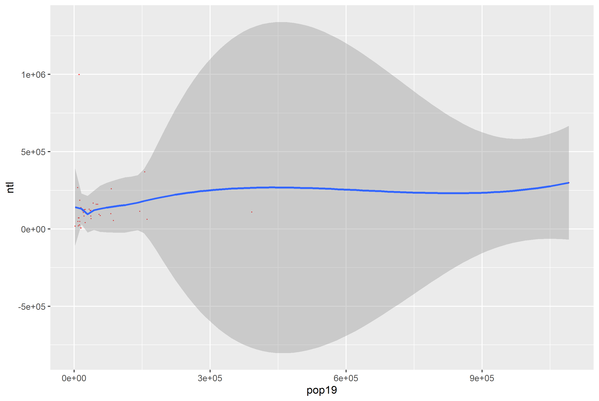

This plot shows how density changes based on where night time lights all over Gabon's subdivisions. This Residual model with regression line represents the correlation of night time lights, urban cover, and bare cover with Gabon’s population distribution.

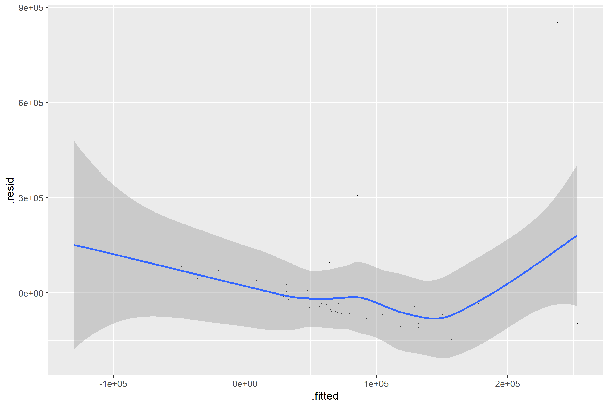

This plot highlights all the outliers including Komo-Mondah that is a striking outlier that is separated from the rest of the regression model and data.  
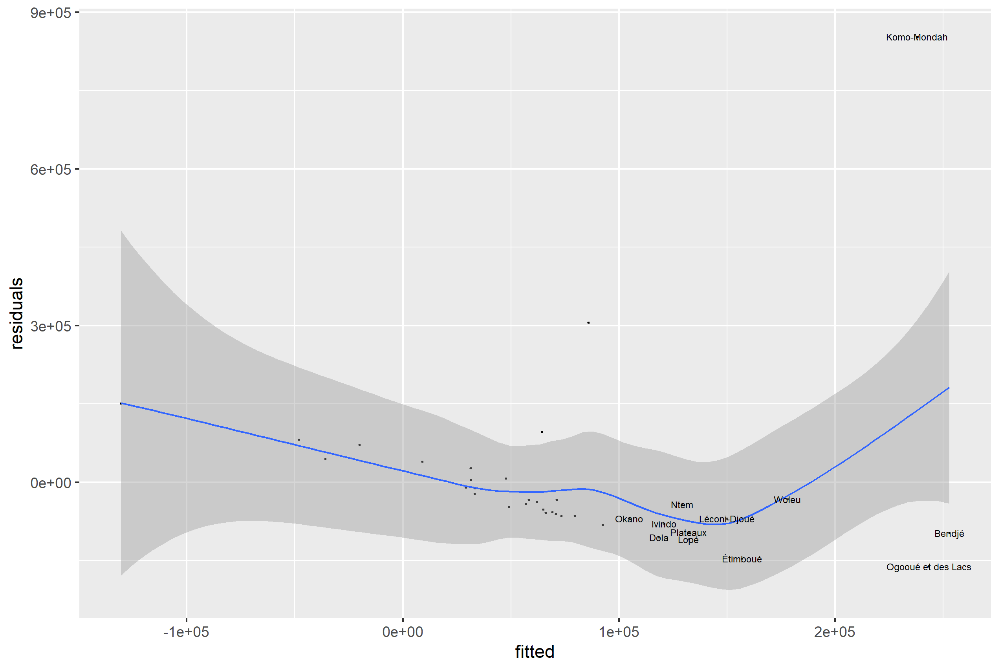

## Part 2: Modeling & Predicting Spatial Values
#### Finding population and differences between our linear model and the actual WorldPop raster information
Our model is serving to allocate population totals across all gridcells, but how accurate is it?  To start we can calculate the different of our predicted values - the worldpop values and sum the totals. Here are the plots that shows how different our model is different than the actual values from the Worldpop website. As obvious our model shows that on the western coast of Gabon, where its capital is located, the population distribution is extremely uneven. In fact, the capital subdivision has as many population as all subdivisions combined. 
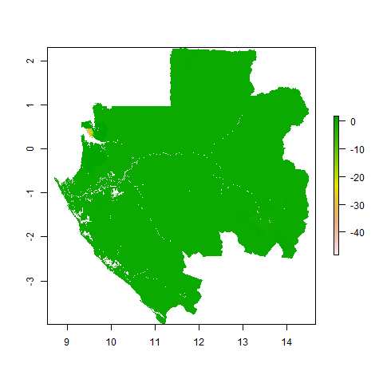
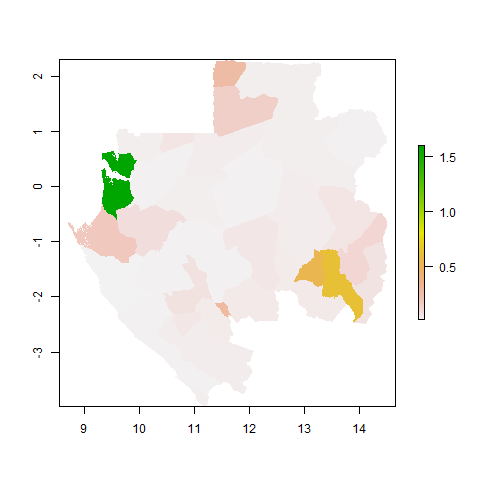

## Subsetting "Komo-Mondah" population and differences between our linear model estimation and the actual Data.
Gabon's capital, Libreville, is located in Komo-Mondah subdivision. Since we don't have access directly to map Libreville, we will subste Komo-Mondah subdivision and plot its population distribution
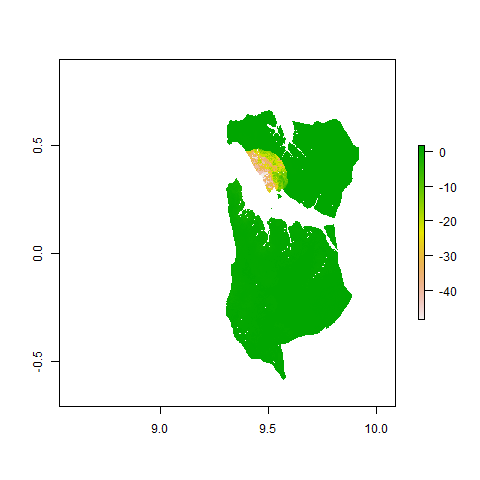
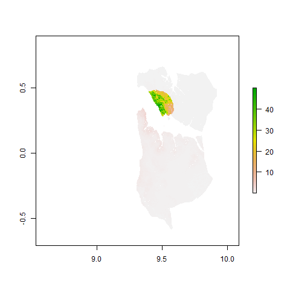

#### A 3-D plot representing population of Komo-Mondah
This 3-D plot shows the population distribution over Komo-Mondah subdivision. The striking data shows that the population distribution on Libreville which is located in the heart of Komo-Mondah is extremely high compared to population distribution on other parts of Komo-Mondah. 
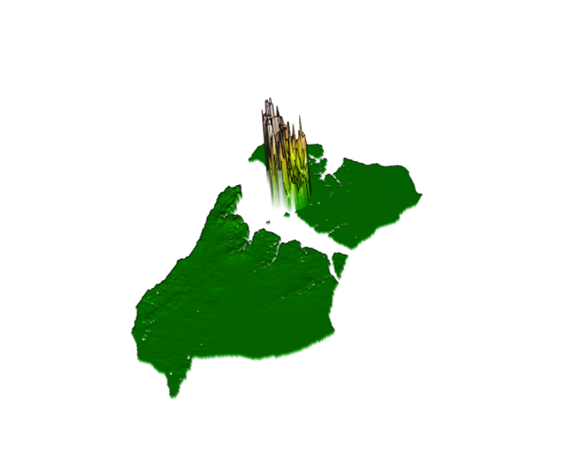

#### A Mapview of Komo-Mondah
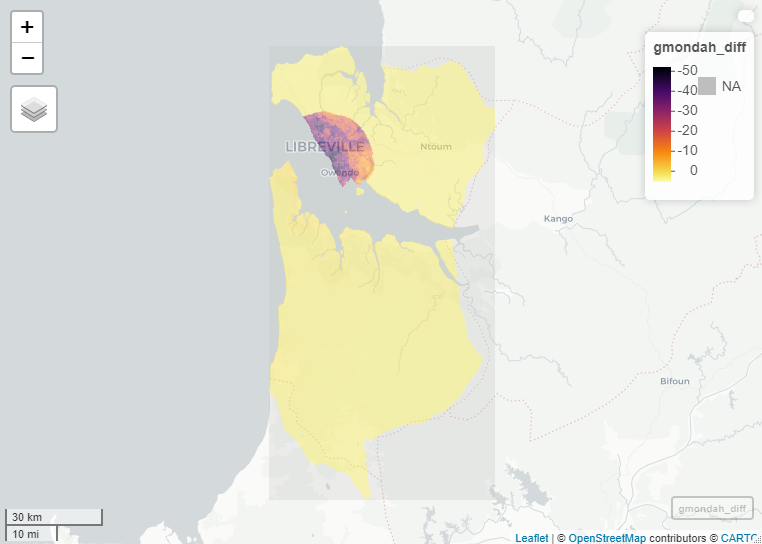

## Subsetting "Mpassa" population and differences between our linear model estimation and the actual Data.
Mpassa is Gabon's other populated subdivision. It is populated due to the Mpassa River running accross it. Historically, people tend to live close to waters. Since Gabon's economy relies on agriculture, most people prefer living near to waters. Below are plots for Mpassa's population distribution and the difference between our model estimation and the Worldpop data.
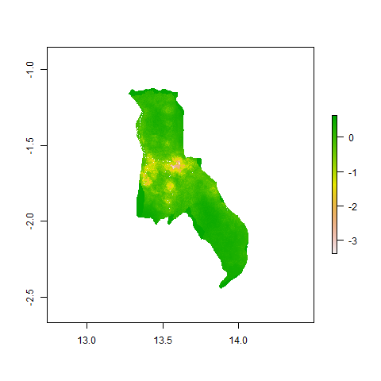
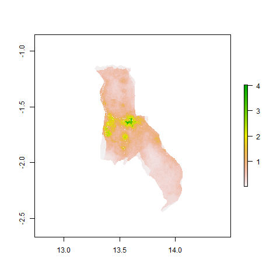

#### A 3-D plot representing population of Mpassa
This 3-D plot shows the population distribution over Mpassa subdivision. The striking data shows that the population distribution on Franceville which is located in the heart of Mpassa is extremely high compared to population distribution on other parts of Mpassa. 

#### A Mapview of Mpassa

## Part 3: Investigating and Comparing Results
#### The original WorldPop population distribution raster

#### Sums, Means, & Log
We will use the lm() function to estimate three models.  First we will use pop19 as the response variable and the sum of each geospatial covariate per adm as the predictors.  Second, again use pop19 as the response variable but this time instead use the mean of each geospatial covariate per adm as the predictors.  Third, use the logarithm of 2019 population log(pop19) as the response and the mean of each geospatial covariate per adm as the predictors.

#### Usings sums model
A linear model is 
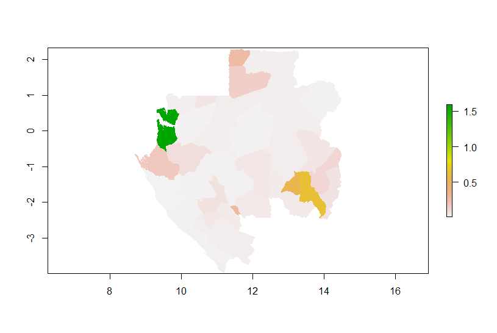
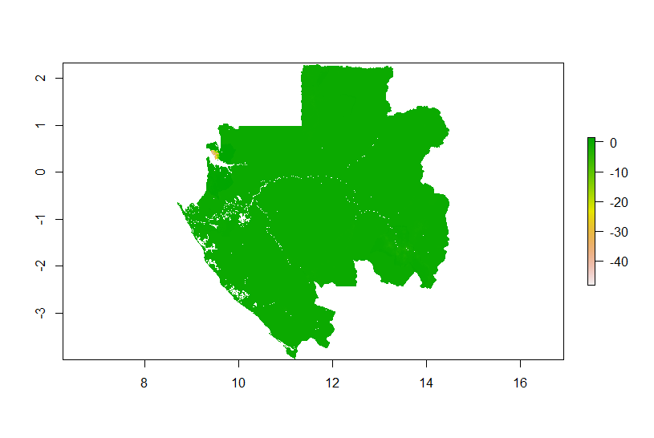
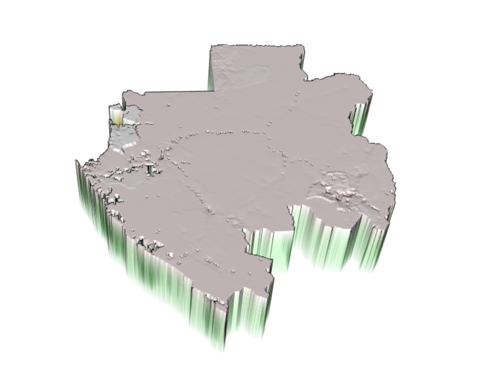

#### using means model

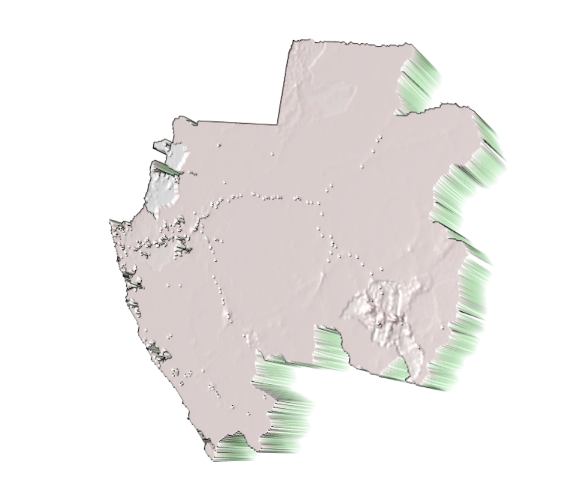

#### using log model

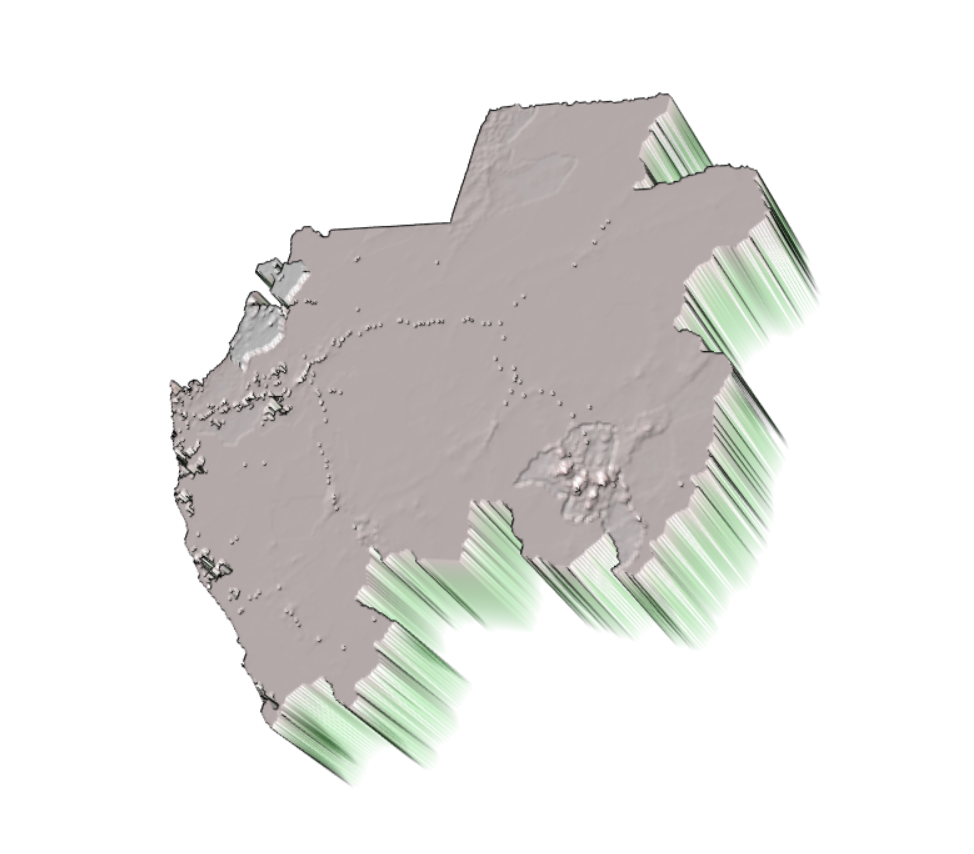

#### stretch goal for part 3
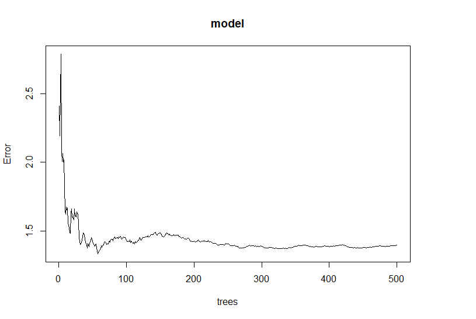
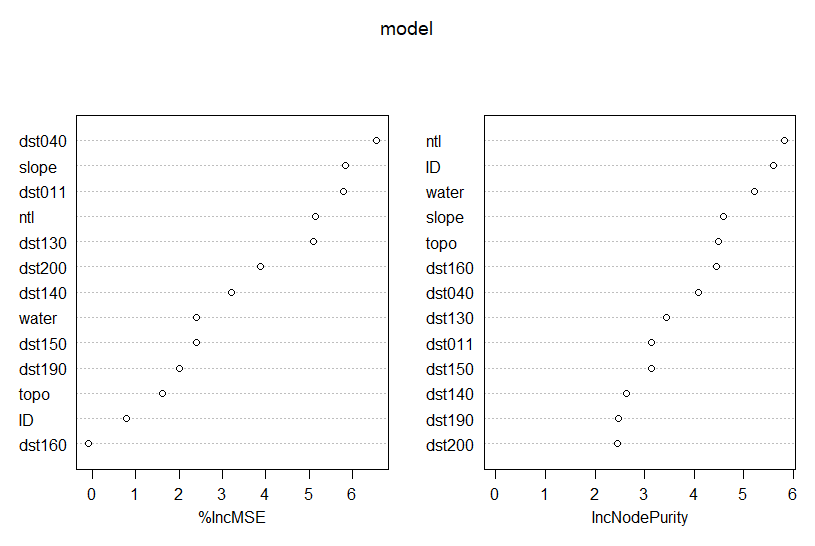

