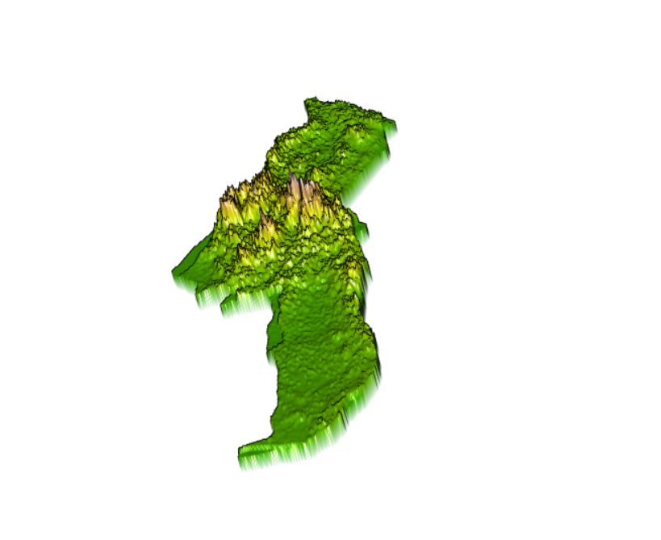

# Project 2: Using Linear Modeling To Analyze Population Distribution
### Sayyed Hadi Razmjo

This Projects Has 3 Parts (Part 3 is done as a Strecth Goal):

## Part 1
###### Extracting Land Use and Land Cover Data for Description

This histogram is desired to show population distribution accross different adm2s. In my adm2 sf object I now have 28 variables including the topo, ntl, and slope covariates.  To start with your description and analysis of the land use and land cover data, I first consider the pop19 variable  created in the last project.  Then, using ggplot(), I produce a histogram using the geom_histogram(). Since the numbers are very big, the log function is used to scale them according to the x-axis. Before using the log function, the numbers are so huge that they don't fit on the x-axis. The histogram is shown below:

This plot shows density based on log of the population accross adm2. We essentially do the same with the geom_density(), adding the log() command by wrapping the pop19 variable within it.

We can see that the density plot has a similar profile as the histogram.  We can compare the two by overlapping the histogram with the density plot. Essentially the area of the histogram and the density plot should be nearly the same, however there are some differences in values and that is why there are some peaks in the plot.
 

We will use the same function but now estimate the population distribution using another covariate variable. This plot shows how density changes based on where night time lights all over Gabon's subdivisions. This Residual model with regression line represents the correlation of night time lights, urban cover, and bare cover with Gabon’s population distribution. In this plot, the log function is not used. 

Now that we have plotted different covariates with rapping pop19 around it, we will regress the data from two variables against each other and examine the coorelationship that is being described by the two variables.This plot does a linear model estimation of population distribution based on night time lights data gathered from online resources. 

 Now that we have enough knowledge of how to use different covariates to do estimations, we will add a few more variables to the lm() command. We can also add all the 12 covariates that we gathered from known online resources. For example in the following plot, I have estimated a regression model where the population of Gabon in 2019 is the dependent variable, while night time lights (ntl), urban cover (dst190), and bare cover (dst200), topo, slope, dst(010), dst(011), dst(130), dst(140), and other covariates are the independent variables (predictors).

###### Stretch Goal:
This plot highlights all the outliers including Komo-Mondah that is a striking outlier, separated from the rest of the regression model and data. The second plot will also present the F-statistics and R-adjusted Squared as we calculate residual standard error.

## Part 2: Modeling & Predicting Spatial Values
#### Finding population and differences between our linear model and the actual WorldPop raster information
##### In this part, we will use the model parameters we previously estimated in order to predict spatial values across the landscape of Gabon. 
Our model is serving to allocate population totals across all gridcells, but how accurate is it?  To start we can calculate the different of our predicted values - the worldpop values and sum the totals. Here are the plots that shows how different our model is different than the actual values from the Worldpop website. As obvious our model shows that on the western coast of Gabon, where its capital is located, the population distribution is extremely uneven. In fact, the capital subdivision has as many population as all subdivisions combined. 
This plot shows the actual raster showing the original population distribution. This raster was retrieved from WorldPop website.

The following plot shows the difference of our predicted values - the worldpop values and sum the totals.

The following plot shows our population distribution prediction in Gabon. 

By looking at the diff plot and the above difference of predicted value from worldpop raster it appears that most of the error is slightly above or below 0, and is also distributed fairly evenly across the entire space.  Looking closely, however, the area close to the western coast and the central Gaon appears to exhibit a different phenomenon. In order to examine those areas closely, we will subset both areas individually to examine their population distribution based on our linear model. 

## Subsetting "Komo-Mondah" population and differences between our linear model estimation and the actual Data.
Gabon's capital, Libreville, is located in Komo-Mondah subdivision. Since we don't directly have access to Libreville map, we will subset Komo-Mondah subdivision and plot its population distribution. One of the reasons this subdivision is highly overpredicted is that it is densely populated. According to 2019 data, Gabon has an estimated population of 2.02 million people and based on estimations, half of the population live in or close to Libreville, given the fact that Libreville is a major business and trade center in Gabon. From the other hand, Komo-Mondah is a coastal city, having a lot of sea ports. The following plots show the population distribution difference between our model and the WorldPop raster. The population plot shows where in Komo-Mondah, the population is concentrated.

#### A 3-D plot representing population of Komo-Mondah
This 3-D plot shows the population distribution over Komo-Mondah subdivision. The striking data shows that the population distribution on Libreville which is located in the heart of Komo-Mondah is extremely high compared to population distribution on other parts of Komo-Mondah. This kind of result was expected given our knowledge of Libreville being the capital and and a trade center in Gabon. 

#### A Mapview of Komo-Mondah

## Subsetting "Mpassa" population and differences between our linear model estimation and the actual Data.
Mpassa is Gabon's other populated subdivision. It is populated due to the Mpassa River running accross it. Historically, people tend to live close to waters. Since Gabon's economy relies on agriculture, most people prefer living near to waters. Below are plots for Mpassa's population distribution and the difference between our model estimation and the Worldpop data.

#### A 3-D plot representing population of Mpassa
This 3-D plot shows the population distribution over Mpassa subdivision. The striking data shows that the population distribution on Franceville which is located in the heart of Mpassa is extremely high compared to population distribution on other parts of Mpassa. 

#### A Mapview of Mpassa

## Part 3: Investigating and Comparing Results
###### In this part, we will use three appraoches to linear modeling and compare the results with each other to see which one produces the best results and outputs. 

#### The original WorldPop population distribution raster
The original raster shows that the population is densely concentrated in Libreville, located in Komo-Mondah, a western coastal subdivision. Below is the original raster retrieved from WorldPop website. 

#### Sums, Means, & Log
We will use the lm() function to estimate three models.  First we will use pop19 as the response variable and the sum of each geospatial covariate per adm as the predictors.  Second, again use pop19 as the response variable but this time instead use the mean of each geospatial covariate per adm as the predictors.  Third, use the logarithm of 2019 population log(pop19) as the response and the mean of each geospatial covariate per adm as the predictors. To help ease distinguishing between our three approaches, we will use different names and lulc objects for sums, and means & logs models. 

#### Usings sums model
Below are the results when using the sums model. 

Population: Predictors - Sums:

Difference: Predictors - Sums:

3D Difference: Predictors - Sums:

#### using means model
Below are the results when using the means model. 
Population: Predictors - means:

Difference: Predictors - means:

3D Difference: Predictors - means:

#### using log model
Below are the results when using the log model. 
Population: Predictors - Log:

Difference: Predictors - Log:

3D Difference and Population: Predictors - Log:

#### Conclusion:
All three approaches produced similar outputs, which indicates that in our case, all three approaches are highly accurate. However, among all our models and approaches to perform a linear modeling, the model using population as the response variable and covariate sums as the predictors showed the best results and has the best prediction and estimation. When comparing the difference of population distribution between the actual WorldPop raster and the sums model estimation, we can see that the sums model has the least over estimation and over prediction, which is a positive point about it. Both the log model and the means model show different over predictions across Gabon's adm2s which shows that those models has some over estimations and tend to overestimate in their error. The population plot produced using the sums model has an error range of 0.5 to 1.5, while the means model and the log model had an error range of -10 to 5 and -5 to 2, which are considerably higher compared to the sums model. When comparing the 3-D plots, the sums model also showed the least number of peaks and holes compared to the means and logs model. Two common error overestimation trend that can be seen on all our plots are the capital subdivison of Komo-Mondah and the Mpassa subdivision in the eastern coast of Gabon, which both are big subdivisions having almost half the population of Gabon together. Therefore, I can conclude that the sums model has the best prediction here and this result is constant and provable using our plots and data. This is the not case for other data types or models. In some cases, sums model can be a better modeling approach, while working with a different kind of data or model, the log model is a better modeling approach due to its ability to compact large data into smaller, readable, and usable data.
#### stretch goal for part 3
In this part, we will estimate a random forest model using the same data we previously used.  We will use the mean values of all grid cells within each adm as the predictors (independent variable) and the log of population as the response (dependent variable). Starting by loading the World Pop raster, we will use the original WorldPop raster to validate our resuts at the end. After installing, unpacking the randomForest model, and using our adm2 to estimate and analyse our already existing data, we will produce two plots each showing the Number of trees needed before Out of Bag Error stabilized (first plot) and Two measures of importance for each of the predictor variables (second plot).

### End of this Project
### By Sayyed Hadi Razmjo
### W&M 2023

