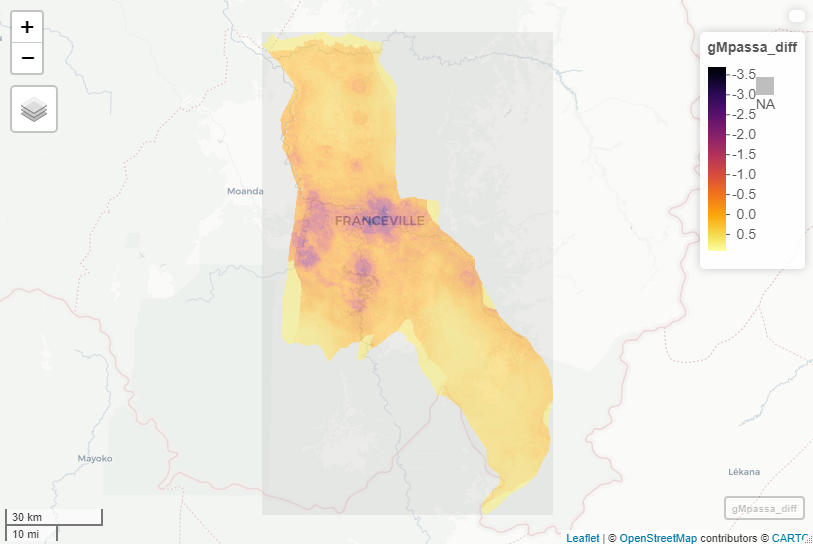

# Project 2 

### Part 1

# Part 2
#### Finding population and differences between our linear model and the actual WorldPop raster information

#### Subsetting "Komo-Mondah" population and differences between our linear model estimation and the actual Data.

#### A 3-D plot representing population of Komo-Mondah

#### A Mapview of Komo-Mondah

#### Subsetting "Mpassa" population and differences between our linear model estimation and the actual Data.

#### A 3-D plot representing population of Mpassa

#### A Mapview of Mpassa

