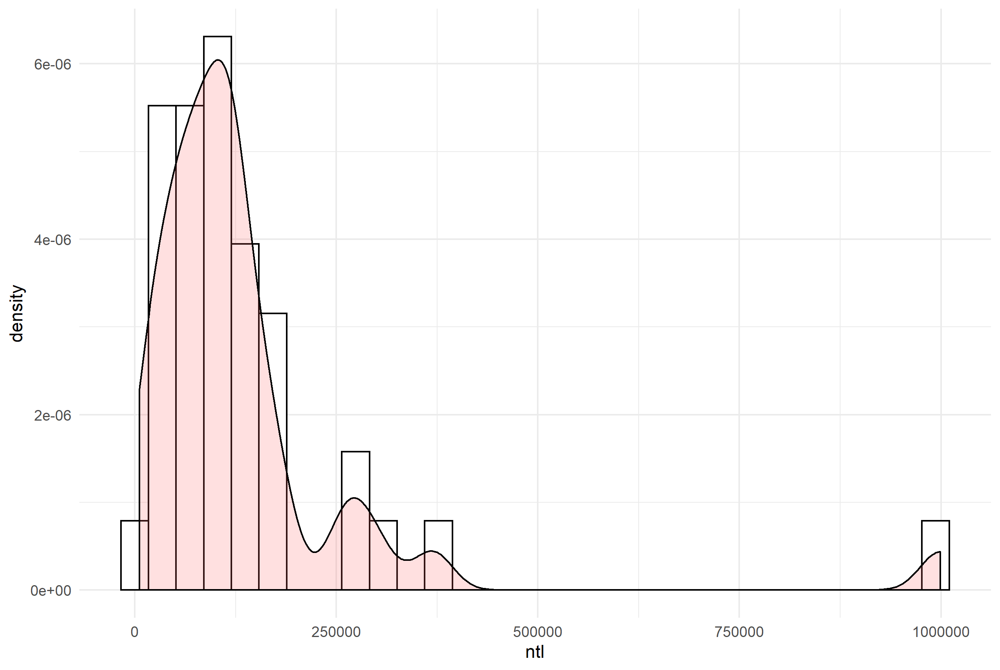

# Project 2: Using Linear Modeling To Analyze Population Distribution
### Sayyed Hadi Razmjo

This Projects Has 3 Parts:

## Part 1
Extracting Land Use and Land Cover Data for Description
This histogram is desired to show population distribution accross different adm2s. Since the numbers are very big, the log function is used to scale them according to the x-axis. 

Notice that the density plot has a similar profile as the histogram.  We can compare the two by overlapping the histogram with the density plot or probability density function. 

This plot merges both the density and histogram plots together for better estimation. 

## Part 2
#### Finding population and differences between our linear model and the actual WorldPop raster information

## Subsetting "Komo-Mondah" population and differences between our linear model estimation and the actual Data.

#### A 3-D plot representing population of Komo-Mondah

#### A Mapview of Komo-Mondah

## Subsetting "Mpassa" population and differences between our linear model estimation and the actual Data.

#### A 3-D plot representing population of Mpassa

#### A Mapview of Mpassa

