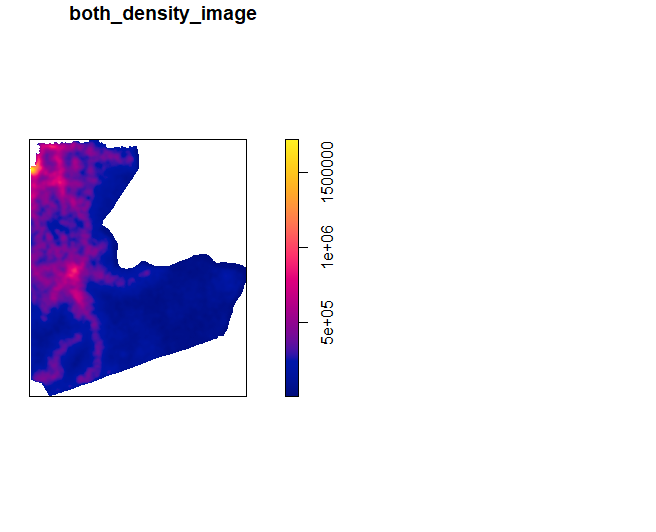

# Project 3 

#### In this project, part 1 and part 2 plots are placed together for ease of follow and consistency.

## Part 1 : De facto description of human settlements and urban areas
## Part 2 : Adding transportation facilities & health care services

#### In this part, one adm2 subdivision called "Léboumbi-Leyou" is selected. Below are 12 plots showing its population distribution, point per person on the map, density based on population, road networks, and healthsites across Léboumbi-Leyou. 

Contour Lines to be added to the density plot:

Contour lines added:

Urbanized areas across Léboumbi-Leyou:

Density Dots added to the Urbanized Areas:

Road Networks across Léboumbi-Leyou:

Road Networks and density shown together:

Healthcare sites across Léboumbi-Leyou:

And finally putting all Road networks, healthsites, and density together:

## Strech Goal 1 Part one and Part two together
#### After Combining two neighbor subdivisions each being "Ntem" and "Woleu", we will find its combined population, point per person, combined density, combined road networks, and combined healthsites across both Ntem and Woleu. 

Combined population distribution across Ntem and Woleu:

Contour lines to be added:

Contour lines added:

Healthsites across Ntem and Woleu together:

Healthsites, Road Networks, and density all together:

.png)

