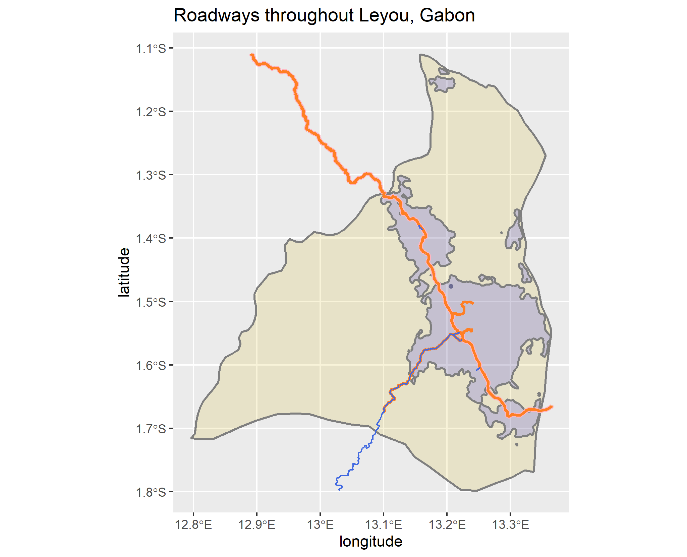
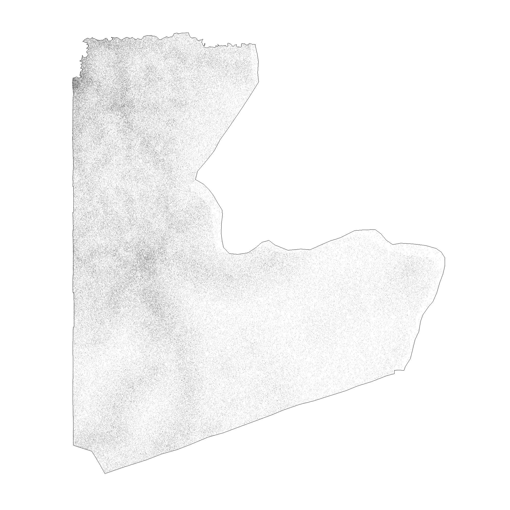
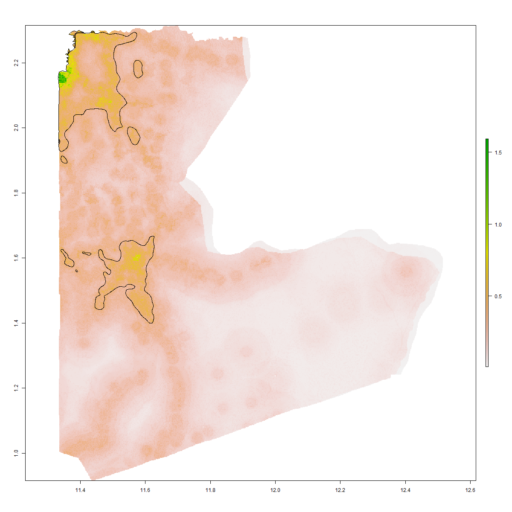

# Project 3 

## Part 1 : De facto description of human settlements and urban areas

#### In this part, one adm2 subdivision called "Léboumbi-Leyou" is selected. The individual strech goal and part 2 are also done for this single subdivison. Later in this deliverable, I will combine two other subdivisons and perform part 2 on it as well. Below are 12 plots showing Léboumbi-Leyou population distribution, point per person on the map, population density, contour lines, urbanized areas, road networks, and healthsites across Léboumbi-Leyou. 

Below you can find the Population per grid cell distribution across Léboumbi-Leyou. As it appears, there are three main urbanzied areas in the center and north. The western part of Léboumbi-Leyou appears to be uninhabited with near to 0 population per grid cell. The reason that population is densely populated on the eastern part is that Léboumbi-Leyou is located on the west of Mpassa, a major business and trade center. Léboumbi-Leyou has a total population of 161099 based on the 2019 population raster downloaded from the WorldPop database. 

The following plot is one instance from a probability model (based on 2019 WorldPop data) used to distribute all 161,099 persons geospatially throughout Léboumbi-Leyou. Every point on this plot represents a person inhabiting Léboumbi-Leyou. As expected, this plot reinforces our population distribution plot shown before. There are three densely populated places while the western and norheastern parts are mostly uninhabited.

Based on our population distribution model and the point per person plot, we plot a density map showing where in Léboumbi-Leyou are highly populated and where is uninhabited. Same as our previous observations, the western part seems mostly blue - meaning that it is not populated, while the central part of Léboumbi-Leyou is red - meaning that it has a higher density compared to other parts of Léboumbi-Leyou. 

We will use contour Lines to distinguish highly populated places from relatively uninhabited parts of Léboumbi-Leyou. Below are the contour lines to be added to the density plot:

Contour lines added:

Urbanized areas across Léboumbi-Leyou: Using our density model and the contour lines we created, now we have all the tools to find and distinguish our de facto human settlements and urban areas. Below you will see the urbanized areas shown as ploygons in lightblue and non-urbanized areas in gold/gray. 

Density Dots added to the Urbanized Areas: To show how dense each polygon is, we will add some density dots to it. The bigger the dots, the more population that area has. The color represents the actual density in that area. 

Now We will add the polygons to our population distribution plot to ensure that our findings are consistent with our initial assumptions. 

Road Networks across Léboumbi-Leyou: This activity is part of the part 2 of the project, where we will add road networks and healthsites to our plot that shows the urbanized areas. The data was downloaded from the HDX website under HOTOSM Gabon Roads (OpenStreetMap Export). Some other databases were also visited, such as the DIVA-GIS. However, after using data from both sources, the data from the HDX website produced more up-to-date and accurate results. Below you can find the road networks that run across Léboumbi-Leyou. The orange line shows the primary asphalt road that runs across Léboumbi-Leyou. As it appears, the primary asphalt road runs across the three polygons that we marked as urban areas. The line and pink line are showing the secondary and tertiary routes, respectively. Both lines are starting from the dense point we previously plotted, showing that the location of all primary, secondary, and tertiary routes are consistent with our findings. Roads, railroads, trails and other means of transportation are primarily located close to urbanized and highly populated areas. 

Road Networks and density shown together:

Healthcare sites across Léboumbi-Leyou: Once again, the only two healthsites in Léboumbi-Leyou are located in one of our polygons and specifically right next to our density point (shown in the next plot as blue dots). Healthcare sites are located close to highly populated areas to ensure that people can easily access to healthcare. 

And finally putting all Road networks, healthsites, and density together: 

## Strech Goal 1 Part one and Part two together
#### After Combining two neighbor subdivisions each being "Ntem" and "Woleu", we will find its combined population, point per person, combined density, combined road networks, and combined healthsites across both Ntem and Woleu. 

Combined population distribution across Ntem and Woleu:

Contour lines to be added:

Contour lines added:

Healthsites across Ntem and Woleu together:

Healthsites, Road Networks, and density all together:

