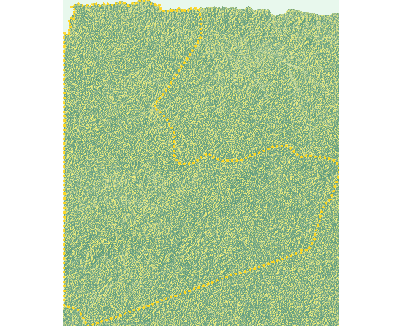
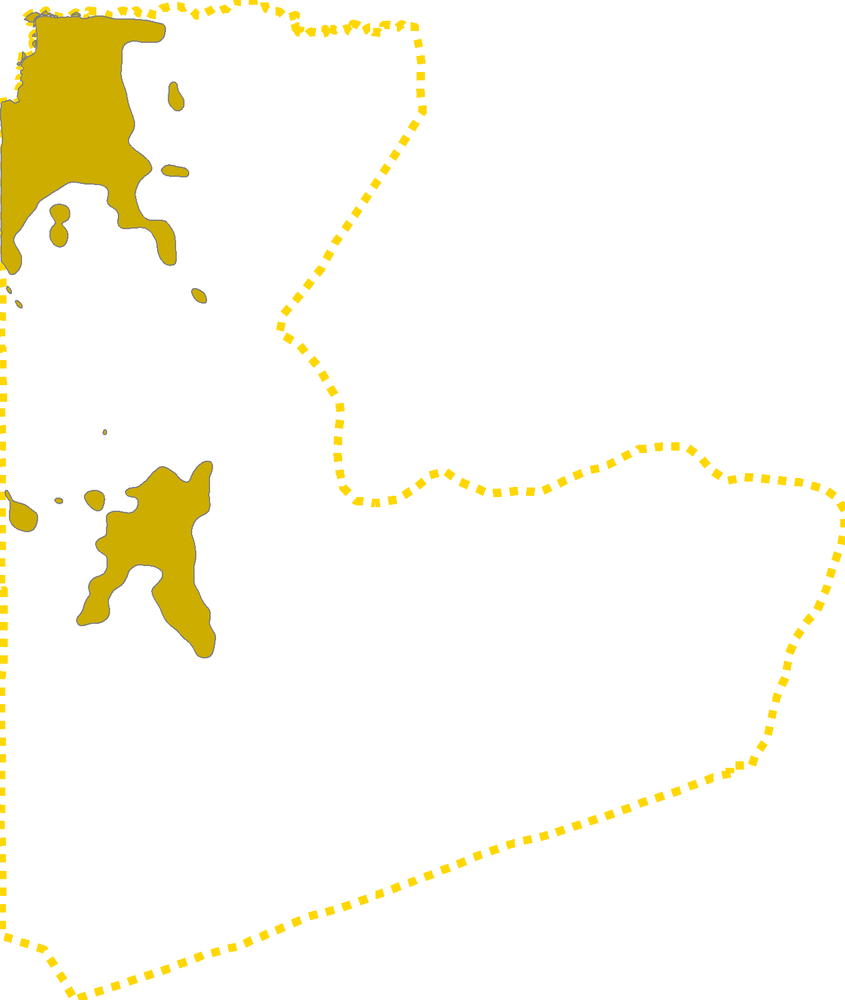
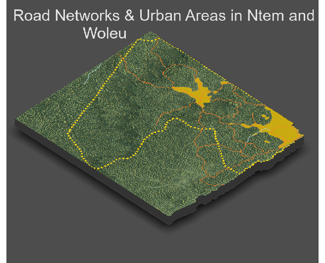
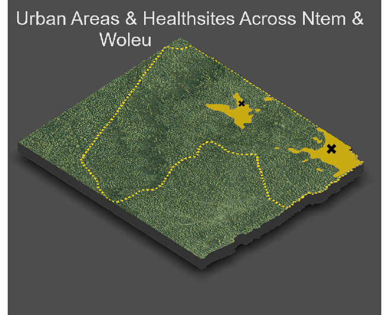
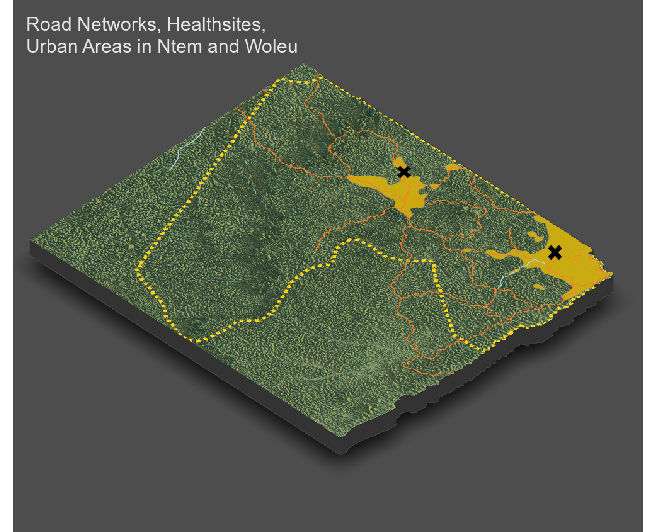
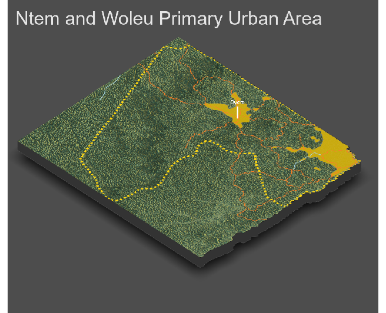

# Project 4: Rendering Topography

#### In this project, we will produce some 3-D plots for our combined adm2s. Using our knowledge of where Urban Areas are located, we will also add our urban areas, road networks, and healthsites to our 3-D plots to ensure that our findings  in project 3 are consistent with our results.

In this project, we will use the topographic raster used in project 2. Since we are only analyzing two adm2s (Ntem and Woleu), we should crop the topo raster based on our combined adm2s. After cropping the topographic raster based on our combined adm2s borders, we will get the following topographic plot. 

Using our combined adm2s data from project 3, we will produce a plot only containing the political boundaries of the combined adm2s, without any backgrounds or labels. We will add this border plot to our topo raster to distinguish our combined adm2s from areas outside our scope of analysis. Below you can find the dotted plot of the political boundaries of the combined adm2s. 

Next, use the border plot to add it on the top of cropped topo plot. The result is a plot showing the topographic details of our combined adm2s. 

First, we should convert the cropped raster into a matrix and apply the ambient_shade() command to the topography matrix to produce a three-dimension plot of our combined adm2s. Using our combined matrix, we will produce a 3-D plot showing the topographic details of the combined adm2s.

Next, using the combined matrix and the political boundaries object, a 3-D plot showing the borders of the combined ad2ms is produced:

We should import the urban areas polygons from project 3 to add it to our 3-D plot. The political boundaries are also added to identify the combined adm2s. 

Next up, the urban areas along with the dotted boundaries are added to the 3-D plot. The topography of the area does not appear to have significant impact on the development of urban areas; however, both urban areas are located near waters. Ntem and Woleu are both coastal cities; thus, creating excellent opportunities for Ntem and Woleu's economies. The waters on the western side of Woleu and northern coast of Ntem, have greatly impacted the population concentration in these cities. The road networks across Ntem and Woleu are added to our 3-D plot showing the urban areas as well. Below the urban areas are shown on our topographic 3-D plot:

Using the HDX's Gabon Road database, the shp data files are downloaded, or alternatively we can use the data objects used in project 3. The effect of topography is more obvious on the development of transportation facilities, which also helps us interpret the effect of topography on the development of urban area as well. In the previous plot, we don't have adequate information to assert that the topography has an impact on development of urban areas. In the following plot, the primary roads and secondary roads are shown using orange and blue lines. The primary roads are going through the heart of our identified urban areas, confirming that development of urban area are directly related to the development of transportation facilities. 

