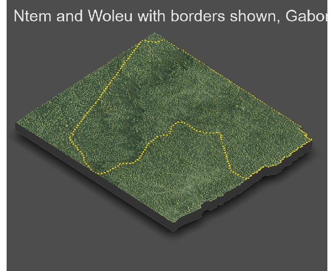

# Project 4: Rendering Topography

#### In this project, we will add produce some 3-D plots for our combined adm2s. Using our knowledge of where Urban Areas are located, we will also add our urban areas, road networks, and healthsites to our 3-D plots to ensure that our findings are consistent with our results in project 3.

After cropping the topographic raster based on our combined adm2s borders, we will get the following topographic plot. 

Using our combined adm2 data from project 3, we will produce a plot only containing the political boundaries of the combined adm2s, without any backgrounds or labels. Below you can find the dotted plot of the political boundaries of the combined adm2s. 

Use the border object to add it on the top of cropped topo plot. 

Using our combined matrix, we will produce a 3-D plot showing the topographic details of the combined adm2s.

Next, using the combined matrix and the political boundaries object, a 3-D plot showing the borders of the combined ad2ms is produced:

We should import the urban areas polygons from project 3 to add it to our 3-D plot. The political boundaries are also added to identify the combined adm2s. 

