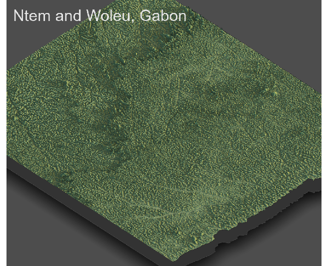

# Project 4: Rendering Topography

#### In this project, we will produce some 3-D plots for our combined adm2s. Using our knowledge of where Urban Areas are located, we will also add our urban areas, road networks, and healthsites to our 3-D plots to ensure that our findings  in project 3 are consistent with our results.

In this project, we will use the topographic raster used in project 2. Since we are only analyzing two adm2s (Ntem and Woleu), we should crop the topo raster based on our combined adm2s. After cropping the topographic raster based on our combined adm2s borders, we will get the following topographic plot. 

Using our combined adm2s data from project 3, we will produce a plot only containing the political boundaries of the combined adm2s, without any backgrounds or labels. We will add this border plot to our topo raster to distinguish our combined adm2s from areas outside our scope of analysis. Below you can find the dotted plot of the political boundaries of the combined adm2s. 

Next, use the border plot to add it on the top of cropped topo plot. The result is a plot showing the topographic details of our combined adm2s. 

First, we should convert the cropped raster into a matrix and apply the ambient_shade() command to the topography matrix to produce a three-dimension plot of our combined adm2s. Using our combined matrix, we will produce a 3-D plot showing the topographic details of the combined adm2s.

Next, using the combined matrix and the political boundaries object, a 3-D plot showing the borders of the combined ad2ms is produced:

We should import the urban areas polygons from project 3 to add it to our 3-D plot. The political boundaries are also added to identify the combined adm2s. 

Next up, the urban areas along with the dotted boundaries are added to the 3-D plot. The topography of the area does not appear to have significant impact on the development of urban areas; however, both urban areas are located near waters. Ntem and Woleu are both coastal cities; thus, creating excellent opportunities for Ntem and Woleu's economies. The waters on the western side of Woleu and northern coast of Ntem, have greatly impacted the population concentration in these cities. Below the urban areas are shown on our topographic 3-D plot:

Using the HDX's Gabon Road database, the shp data files are downloaded, or alternatively we can use the data objects used in project 3. The effect of topography is more obvious on the development of transportation facilities, which also helps us interpret the effect of topography on the development of urban area as well. In the previous plot, we don't have adequate information to assert that the topography has an impact on development of urban areas. In the following plot, the primary roads and secondary roads are shown using orange and blue lines. The primary roads are going through the heart of our identified urban areas, confirming that development of urban area are directly related to the development of transportation facilities. The terrain characteristics of settlements can help to understand the effects of the environment on human activities. No major mountains can be observed in the 3-D plot of Ntem and Woleu; rather, almost the whole area is covered with forests and trees, having a lot of precipitation; therefore, creating an ideal opportunity for the population for agricultural businesses- it is not surprising that Gabon's economy is heavily relied on its agricultural products. The vast number of transportation lines show how these subdivisions are highly interconnected with each other to ease the flow of goods and services between the adm2s. The topography of the area seems to support this assumption. 

Based on the HDX database, there are only two healthcare facilities across our combined adm2s. One is located in the Ntem subdivison and one is located in the heart of Woleu. Both are coastal subdivisons and highly populated especially in the western part. Although not enough to provide healthcare for all the people living in those adm2s, both healthsites are carefully built and located. Both healthsites are located at the heart of each subdivison, ensuring the centrality of the healthsite. However, even if completely mobolized those two healthsites, they cannot provide excellent healthcare for the 232000 population of those combined subdivisions. Once again, the topography of the area doesn't seem to directly impact the location of health care facilities. The topography of the region seems to support the existence of any kind of healthcare facility throughout the whole region. In this case, rather, the location of the urban areas seem to affect the location of the healthcare facilities. As previously mentioned, both healthcare facilities are located in one of our two identified urban areas, implying that the concentration of population in those two urban areas is a crucial factor in where those healthcare facilities are located. 

Putting healthcare sites, road networks, and urban areas all together:

Below you can see Woleu's one of the most densely populated villages, called Oyem. This village only has a population of over 35000 people, almost 1/6 of the whole region's population. 

Given all our investigations, producing these three-dimensional maps did not result in an interpretion different from our previous analysis. At the end of project 3, we asserted that the location of both transportation facilities and healthcare facilities are directly related to the location of urban areas. We also argued that the location of our identified urban areas is related to the fact that people tend to populate cities that are either near waters or have major business opportunities. After plotting the 3-D plots, I did not get any surprising results; it just supported our previous assumptions and analysis. The topography of the region does not show any natural obstacles or any specific natural advantages to development of urban areas, transportation facilities and healthcare facilities. Below you can find a final 3-D plot showing all road networks, healthcare facilities, urban areas, and a primary identified urban area in Woleu, Gabon.

