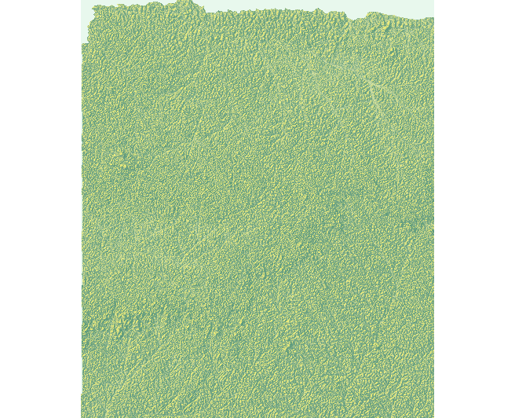
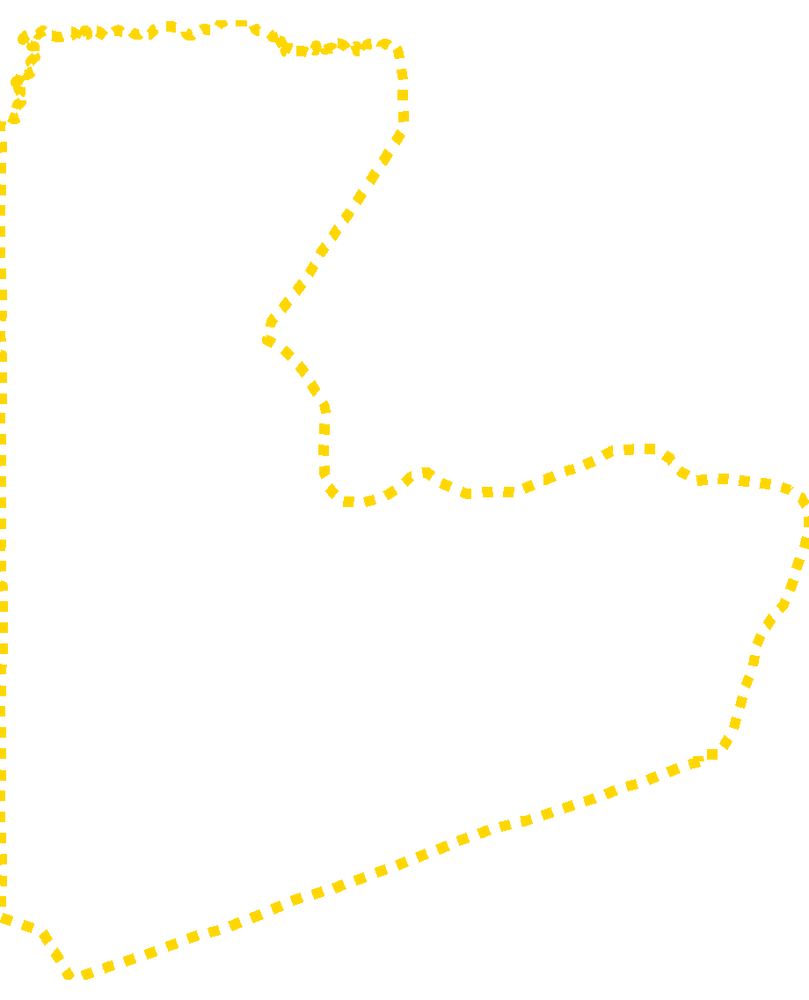

# Project 4: Rendering Topography

#### In this project, we will add produce some 3-D plots for our combined adm2s. Using our knowledge of where Urban Areas are located, we will also add our urban areas, road networks, and healthsites to our 3-D plots to ensure that our findings are consistent with our results in project 3.

